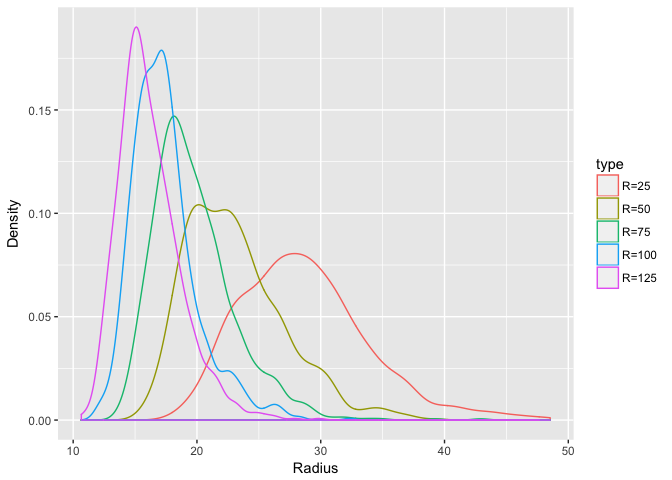
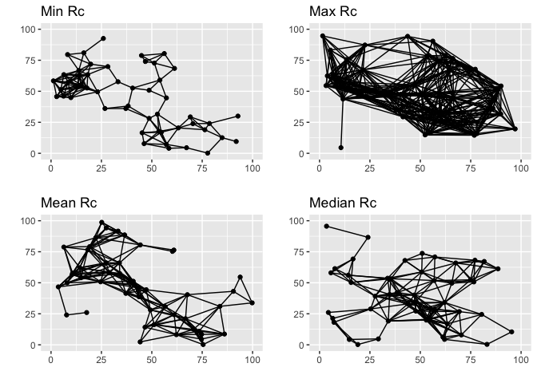

Ad Hoc Network Simulation Project
================
Wei-Hsin(Philip) Lin, Yang Yang, Tien Nguyen
10/25/2016

Introduction
------------

Wireless networks are all around us. Cell phones communicate with a base-station to send and receive calls. Calls are relayed from base-station to base-station as the cell phone moves away from one and closer to another. A new idea of organizing networks is to avoid the need for a central base-station that coordinates communications. Instead, messages are relayed by “hopping” from one node to the next to the next until it reaches its destination. In other words, one can send a message by using other devices in the network to relay the message to the next device, and so on. These are called ad hoc networks because there is no centralized node or fixed structure or topology for the network. Instead, devices can move over time, and dynamically enter and exit the network. And so the route a message takes from one device to another depends on the other nodes. Ad hoc networks are very promising and becoming important. At their most immediately practical, ad hoc networks can allow nodes outside of a regular network to communicate by piggy-backing off of nodes within the network. Think of driving along and being between base-stations and so your cell phone call would be dropped. But because of ad hoc networks, your data is relayed through cell phones in other cars closer to the base stations. More ambitously, ad hoc networks might be used in controlling traffic on highways by allowing cars communicate with each other. A very basic aspect of ad hoc networks that people need to understand is how the communication and complete connectivity changes with respect to the broadcasting power. Increased power levels allow one to send a message over a larger distance.

Task 1
------

Start by writing a function to generate nodes in an ad hoc network. The function should meet the following conditions:

1.  The name of the functions is genNodes()
2.  Input argument: n, the number of nodes to generate (required).
3.  Return value: an n by 2 vector with the first column representing the x coordinates and the second columns the y coordinates of the nodes.

Use acceptance-rejection sampling to generate the points at random in the network. The nodes should be generated at random on a 2-dimensional grid shown in Figure 1, where the node density is proportional to the function shown in Figure 2. A density function called, nodeDensity(), is supplied to help you. This function takes two inputs: x and y, two numeric vectors of the same length. The function returns a numeric vector of values that are proportional to node density at the (x,y) pairs. This function is available on the Web and can be sourced into your R session with

``` r
#source the function "nodeDensity"
source("http://www.stat.berkeley.edu/users/nolan/data/nodeDensity.R")
```

``` r
# Generating random nodes in ad hoc network
genNodes = function(n) {
  #filter input
  if(!is.numeric(n)) stop("n must be numeric")
  if(length(n) > 1){
    n = n[1]
    warning("n has length > 1 and only the first element will be used")
  }

  #zMax calculation
  x = seq(0,100, by = 0.5)
  y = seq(0,100, by = 0.5)
  gridPts = expand.grid(x,y)
  zMax = max(nodeDensity(gridPts$Var1, gridPts$Var2))
  
  #special case n is 1
  if(n == 1){
    x1 = runif(1, 0, 100)
    y1 = runif(1, 0, 100)
    z1 = runif(1, 0, zMax)
    nodes <- matrix(c(x1, y1), nrow = 1, ncol = 2, 
                    dimnames = list(1, c("x", "y")))
    return(nodes)
  }
  #initial condition for while loop
  i = 2
  keep = FALSE
  #while loop to get more than n points accepted
  while(sum(keep) < n){
    x_n = runif(i*n, 0, 100)
    y_n = runif(i*n, 0, 100)
    z_n = runif(i*n, 0, zMax)
    
    keep = z_n <= nodeDensity(x_n, y_n)
    
    nodes = matrix(c(x_n, y_n), nrow = i*n, ncol = 2)
    nodes = nodes[keep, ]
    i = i + 1
  }
  #return n accepted points
  nodes <- matrix(nodes[1:n, ], nrow = n, dimnames = list(c(1:n), c("x", "y")))
  return(nodes)
}
```

Task 2
------

For a given configuration of nodes, find the smallest radius, Rc, such that the network is completely connected. Write a function to find Rc for a given collection of nodes. This function has the following properties:

1.  The function is called findRc()
2.  The first input parameter is nodes. It is required. This input is a 2-column matrix of the x and y locations of the nodes
3.  The second input parameter is too. It has a default value of 0.05, which is the tolerance level for how close you need to get to the true value of Rc for the provided configuration.
4.  The return value is a numeric vector of length 1, that holds the value of Rc (or a value close to it).

We are interested in finding the smallest power level that leads to a connected network. We assume here that power level is proportional to the radius, R, of a circle centered on the node, and two nodes are in direct communication if the distance between them is less than R. The task of finding Rc relies on a probability argument, some mathematics, and a search algorithm. These are described in the background section. There you will be asked to write a couple of helper functions for findRc().

``` r
#Function to find distance matrix
findDisMat <- function(nodes){
  dismat <- as.matrix(dist(nodes))
  return(dismat)
}
```

``` r
# Find the transition matrix
findTranMat = function(dismat, R){
  logicMat <- matrix(as.numeric(dismat <= R), nrow = nrow(dismat))
  probFunc <- function(x){
    result <- x/sum(x)
    if(all(is.nan(result))) result <- rep(0, nrow(dismat))
    return(result)
  }
  transMat <- t(apply(logicMat, 1, probFunc))
  return(transMat)
} 
```

``` r
# Find the 2nd largest eigenvalue
getEigen2 = function(transMat) {
  eigen = eigen(transMat, only.values = TRUE)
  index = order(eigen$values, decreasing = TRUE)[2]
  return (eigen$values[index])
}
```

``` r
# Find the range of R
findRange = function (dismat) {
  a = vector(length = nrow(dismat))
  b = vector(length = nrow(dismat))
  for (i in 1:nrow(dismat)) {
    a[i] = dismat[i,][[order(dismat[i,])[2]]]
    b[i] = max(dismat[i,])
  }
  return(c(max(a), min(b)))
}
```

``` r
# Find Rc
findRc = function(nodes, tol = 0.05) {
  #Condition check
  if (nrow(nodes) == 1) stop ("There's only one point. It's self-connected")
  
  dismat = findDisMat(nodes)
  range = findRange(dismat)
  leftEnd = range[1]
  rightEnd = range[2]
  
  if (leftEnd == rightEnd) return (leftEnd)
  while ((rightEnd - leftEnd) > tol) {
    midpoint = (leftEnd + rightEnd)/2
    P = findTranMat(dismat = dismat, R = midpoint)
    eigen2 = getEigen2(P)
    if (isTRUE(all.equal(1, Mod(eigen2)))) {
          leftEnd = midpoint
    } else {
          rightEnd = midpoint
    }
  }
  return (rightEnd)
}
```

Task 3
------

Generate 1000 networks and for each find the value for Rc. Examine the distribution of these Rc values. Some questions for you to consider are the following:

1.  How does Rc, the smallest radius such that the network is connected, change with different node configurations?
2.  Explore the distribution of Rc. Is it symmetric, skewed, long tailed, multimodal?
3.  Plot the network of connected points for four of your 1000 node configurations corre- sponding roughly to the min, median, mean, and maximum values of Rc.

``` r
#Require ggplot2 for later plots
require(ggplot2)
```

    ## Loading required package: ggplot2

``` r
#Create list of 1000 elements, 25 nodes each
nodesList25 = vector("list",1000)
nodesList25 = lapply(nodesList25, function(x) genNodes(25))
radius25 = sapply(nodesList25, function(x) findRc(x))
#Create list of 1000 elements, 50 nodes each
nodesList50 = vector("list",1000)
nodesList50 = lapply(nodesList50, function(x) genNodes(50))
radius50 = sapply(nodesList50, function(x) findRc(x))
#Create list of 1000 elements, 75 nodes each
nodesList75 = vector("list",1000)
nodesList75 = lapply(nodesList75, function(x) genNodes(75))
radius75 = sapply(nodesList75, function(x) findRc(x))
#Create list of 1000 elements, 100 nodes each
nodesList100 = vector("list",1000)
nodesList100 = lapply(nodesList100, function(x) genNodes(100))
radius100 = sapply(nodesList100, function(x) findRc(x))
#Create list of 1000 elements, 125 nodes each
nodesList125 = vector("list",1000)
nodesList125 = lapply(nodesList125, function(x) genNodes(125))
radius125 = sapply(nodesList125, function(x) findRc(x))
```

``` r
radiusDF = data.frame(radius25, radius50, radius75, radius100, radius125)

radiusDF = data.frame (counts = c(radiusDF$radius25, radiusDF$radius50, radiusDF$radius75, radiusDF$radius100, radiusDF$radius125), type = rep(c("R25", "R50", "R75", "R100", "R125"), each = nrow(radiusDF)))

radiusDF$type = factor (radiusDF$type, levels = c("R25", "R50", "R75", "R100", "R125"), labels = c("R=25", "R=50", "R=75", "R=100", "R=125"))

rcDensity <- 
  ggplot(data = radiusDF, aes(x = counts, y = ..density.., color = type)) +
  geom_density() + 
  labs(x = "Radius", y = "Density")

rcDensity
```



This graph superposes five density distributions of radius corresponding to the values of n (25, 50, 75, 100, 125). As the number of nodes increase from 25 to 125, the peak of the distributions increase, the shape of the distributions become more right-skewed, and the right tails become longer.

``` r
plotFunc <- function(nodes, Rc, title = NULL){
  dismat = findDisMat(nodes)
  dismat[upper.tri(dismat, diag = TRUE)] = NA
  connect = which(dismat < Rc, arr.ind = TRUE)
  mapping = data.frame(x = nodes[,"x"][connect[, "col"]], xend = nodes[,"x"][connect[, "row"]], 
                       y = nodes[,"y"][connect[, "col"]], yend = nodes[,"y"][connect[, "row"]])
  
  plot <- ggplot(data = as.data.frame(nodes), aes(x = x, y = y)) + 
    geom_segment(data = mapping, aes(x = x, xend = xend, y = y, yend = yend)) + 
    geom_point() + 
    xlim(0, 100) + ylim(0, 100) + labs(x = '', y = '') + 
    ggtitle(title)
  
  return(plot)
}
```

``` r
#Conditions to find min, max, median, and mean for exploring 1000 Rc's of 50 nodes
rMinIndex <- which(radius50 == min(radius50))
rMaxIndex <- which(radius50 == max(radius50))
rMedianIndex <- which(abs(median(radius50) - radius50) == min(abs(median(radius50) - radius50)))[1]
rMeanIndex <- which(abs(mean(radius50) - radius50) == min(abs(mean(radius50) - radius50)))[1]
#Extract the nodes and corresponding radiuses
minRcNodes <- nodesList50[[rMinIndex]]
minR <- radius50[rMinIndex]
maxRcNodes <- nodesList50[[rMaxIndex]]
maxR <- radius50[rMaxIndex]
medianRcNodes <- nodesList50[[rMedianIndex]]
medianR <- radius50[rMedianIndex]
meanRcNodes <- nodesList50[[rMeanIndex]]
meanR <- radius50[rMeanIndex]
```

``` r
require (gridExtra)
```

    ## Loading required package: gridExtra

``` r
plotMin = plotFunc(minRcNodes, minR, "Min Rc") 
plotMax = plotFunc(maxRcNodes, maxR, "Max Rc")
plotMedian = plotFunc(medianRcNodes, medianR, "Median Rc")
plotMean = plotFunc(meanRcNodes, meanR, "Mean Rc")
grid.arrange(plotMin, plotMax, plotMean, plotMedian, ncol = 2)
```



This graph compares the min, max, mean, and median radius by setting number of nodes to 50. All nodes are connected under these four values of radius, but different values of radius create different number of connection between each pair of nodes. Min radius gives the least number of connection, and max radius generates the most connections. Connections created by mean and median radius are approximately the same, and somewhere between the numbers of connections generated by min and max radius.
