Election Project
================
Wei-Hsin (Philip) Lin, Tien Nguyen, Yang Yang, Jinjin Tang, Zhi Chao Poh
12/9/2016

Data Extraction Phase
---------------------

In the data extraction phase of the project, we look separately at six sources from various locations containing data on the (i) 2016 Election Results; (ii) 2012 Election Results; (iii) 2008 Election Results; (iv) 2004 Election Results; (v) 2010 Census; and (vi) County Location.

For each of the first four datasets, we aim to extract a data frame with the columns (i) state ("state"); (ii) county ("county"); (iii) republican votes ("repVote"); and (iv) democrat votes ("demVote"). For the 2010 Census data, we aim to extract a data frame with the columns (i) state ("state"); (ii) county ("county"); and (iii) 35 other relevant variables described below. For the County Location data, we aim to obtain a data frame with the columns (i) state ("state"); (ii) county ("county"); (iii) longitude ("longitude"); and (iv) latitude ("latitude"). It should be noted that the percentages of votes in each county are not considered in the analysis, and only the votes of each of the two main parties are considered.

Below, we will present a general overview and description of parsing for each dataset before presenting the R code for that segment. Specifics are denoted by comments for code blocks in the code, and it should be noted that certain steps relating to data cleaning, which may not be described in the overview, will be touched on and explained subsequently in the report. The following code defines the parameters defining whether to load the saved pre-existing dataframes into the workspace.

### 2016 Presidential Election Results

Data for the 2016 Presidential Election Results were available as a CSV file with 17 columns - of which we were interested in the columns "votes\_dem", "votes\_gop", "county\_name", "state\_abbr" which represented the "demVote", "repVote", "county", and "state" respectively. They were eventually extracted into the final eDF2016 dataframe. The code is as follows:

``` r
if (createAllSources) {
  
    require(readr)
    
    # Reading the data from the CSV file
    
    dataURL = "http://www.stat.berkeley.edu/users/nolan/data/voteProject/2016_US_County_Level_Presidential_Results.csv"
    eDF2016_Raw = read.csv(url(dataURL))
    
    # Extracting only relevant columns and removing duplicates
    
    eDF2016_Raw = eDF2016_Raw[c(2:3, 9:10)]
    eDF2016_Raw = unique(eDF2016_Raw)
    
    # Removing additional words and punctuation lower-casing county
    
    eDF2016_Raw$county_name = tolower(eDF2016_Raw$county_name)
    eDF2016_Raw$county_name = gsub("(county)|(parish)|(city)|([[:punct:]])| ", "", eDF2016_Raw$county_name)
    
    # Reading and mergin additional state data online to convert abbreviations
    
    extDataURL = "http://www.fonz.net/blog/wp-content/uploads/2008/04/states.csv"
    eDF2016_ExtData = read.csv(url(extDataURL))
    eDF2016_Raw = merge(eDF2016_Raw, eDF2016_ExtData, by.x = "state_abbr", by.y = "Abbreviation")
    
    # Removing additional words and punctuation lower-casing state
    
    eDF2016_Raw$State = tolower(eDF2016_Raw$State)
    eDF2016_Raw$State = gsub("([[:punct:]])|( )", "", eDF2016_Raw$State)
    
    # Combining repeated cities together 
    
    dup1 = which(duplicated(eDF2016_Raw[, 4:5]) == TRUE)
    dup2 = which(duplicated(eDF2016_Raw[, 4:5], fromLast = TRUE))
    for (i in 1:length(dup1)) {
        eDF2016_Raw[dup1[i], 2:3] = eDF2016_Raw[dup1[i], 2:3] + eDF2016_Raw[dup2[i], 2:3]
    }
    eDF2016_Raw = eDF2016_Raw[-dup2, ]
    
    # Creating the mergeID for subsequent merging and creating the final 
    
    eDF2016_Raw$mergeID = paste(eDF2016_Raw$State, eDF2016_Raw$county_name, sep="")
    eDF2016 = data.frame(mergeID = eDF2016_Raw$mergeID, state2016 = eDF2016_Raw$State, county2016 = eDF2016_Raw$county_name, repVote2016 = eDF2016_Raw$votes_gop, demVote2016 = eDF2016_Raw$votes_dem)
    save(eDF2016, file = "eDF2016.rda")
} else {
    load("eDF2016.rda")
}
```

### 2012 Presidential Election Results

Data for the 2012 Presidential Election Results were available as multiple XML files online for each state, each with a similar URL ending with a different state name. To extract these results, we first created a data frame containing a column of URLs to each of these XML files. For each of these URLs, we then obtained the "state", "county", "demVote", and "repVote" by parsing the respective XML files. The code is as follows:

``` r
if (createAllSources) {
  
    require(XML)
    
    # Reading the state list from an online text file
    
    dataURL = "http://www.stat.berkeley.edu/~nolan/data/voteProject/countyVotes2012/stateNames.txt"
    stateLinksDF = read_delim(dataURL, delim = '')
    stateLinks = vector(length = length(stateLinksDF$states))
    
    # Piecing together URL links for each state into stateLinks
    # Removing alaska as there is no xml file for it
    
    for (i in 1:length(stateLinks)) {
        baseURL = "http://www.stat.berkeley.edu/users/nolan/data/voteProject/countyVotes2012/"
        stateLinks[i] <- paste(baseURL, stateLinksDF$states[i], ".xml", sep = "")
    }
    stateLinksDF = data.frame(states = stateLinksDF$states, link = stateLinks, stringsAsFactors = FALSE)
    stateLinksDF = stateLinksDF[-2, ]
    
    # Parse each xml file and combine data from all of them
    
    for(i in 1:nrow(stateLinksDF)) {
        doc = xmlParse(stateLinksDF[i,2])
        root = xmlRoot(doc)
        
        # Parsing out demVote, repVote, county, and state from each xml file
        
        demVote = xpathSApply(root, '//tr[@class = "party-democrat" or @class = "party-democrat race-winner"]/td[@class = "results-popular"]', xmlValue)
        demVote = as.integer(gsub("[ ,]","", demVote))
        repVote = xpathSApply(root, '//tr[@class = "party-republican" or @class = "party-republican race-winner"]/td[@class = "results-popular"]', xmlValue)
        repVote = as.integer(gsub("[ ,]","", repVote))
        county = xpathSApply(root, '//tbody/tr/th[@class="results-county"]', xmlValue)
        county = gsub("[0-9]+[[:punct:]][0-9]+% [Rr]eporting", "", county)
        state  = rep(stateLinksDF[i,1], times = length(demVote))
        
        # Combining data from each xml file together
        
        eDF2012_temp =  data.frame(state, county, demVote, repVote, stringsAsFactors = FALSE)
        if (i == 1) { 
            eDF2012_Raw = eDF2012_temp
        }
        else {
            eDF2012_Raw = rbind(eDF2012_Raw, eDF2012_temp)
        }
    }
    
    # Removing additional words and punctuation lower-casing county and state
    # Replacing saint with st in counties
    
    eDF2012_Raw$county = tolower(eDF2012_Raw$county)
    eDF2012_Raw$county = gsub("(county)|(parish)|(city)|([[:punct:]])|( )", "", eDF2012_Raw$county)
    eDF2012_Raw$state = tolower(eDF2012_Raw$state)
    eDF2012_Raw$state = gsub("([[:punct:]])|( )", "", eDF2012_Raw$state)
    eDF2012_Raw$county = gsub("saint", "st", eDF2012_Raw$county)
    
    # Change county names in 2012 to names used in other datasets  for consistency
    # For eg: saint to st, jeffdavis to jeffersondavis, shannon to oglala,
    # Brooklyn county (NY) to King, Manhanttan (NY) to new york, Staten Island (NY) to Richmond
    
    eDF2012_Raw$county = gsub("saint", "st", eDF2012_Raw$county)
    eDF2012_Raw$county[(eDF2012_Raw$state == 'louisiana' | eDF2012_Raw$state == 'mississippi') & (eDF2012_Raw$county == 'jeffdavis')] = 'jeffersondavis'
    eDF2012_Raw$county[eDF2012_Raw$state == "southdakota" & eDF2012_Raw$county == "shannon"] = "oglala"
    eDF2012_Raw$county[(eDF2012_Raw$state == "newyork") & (eDF2012_Raw$county == "brooklyn")] = "kings"
    eDF2012_Raw$county[(eDF2012_Raw$state == "newyork") & (eDF2012_Raw$county == "manhattan")] = "newyork"
    eDF2012_Raw$county[(eDF2012_Raw$state == "newyork") & (eDF2012_Raw$county == "statenisland")] = "richmond"
    
    # Creating the mergeID for subsequent merging and creating the final dataframe
    eDF2012_Raw["mergeId"] = paste(eDF2012_Raw$state, eDF2012_Raw$county, sep='')
    eDF2012 = data.frame(mergeID = eDF2012_Raw$mergeId, state2012 = eDF2012_Raw$state, county2012 = eDF2012_Raw$county, repVote2012 = eDF2012_Raw$repVote, demVote2012 = eDF2012_Raw$demVote)
    
    # Combining repeated cities together 
    dup1 = which(duplicated(eDF2012[, 2:3]) == TRUE)
    dup2 = which(duplicated(eDF2012[, 2:3], fromLast = TRUE))
    for (i in 1:length(dup1)) {
        eDF2012[dup1[i], 4:5] = eDF2012[dup1[i], 4:5] + eDF2012[dup2[i], 4:5]
    }
    eDF2012 = eDF2012[-dup2, ]
    save(eDF2012, file = "eDF2012.rda")
} else {
    load("eDF2012.rda")
}
```

### 2008 Presidential Election Results

Data for the 2008 Presidential Election Results were available as an excel file with multiple sheets. To extract these results, we read and combined the data from all the individual sheets in the columns "state", "county", "Obama", and "McCain" to obtain the desired columns of "state", "county", "demVote", and "repVote" respectively. The code is as follows:

``` r
if (createAllSources) {
    
    library(readxl)
    
    # Combining the data from different worksheets in the excel file into an initial dataframe
    
    eDF2008 = read_excel("countyVotes2008.xlsx", sheet = 2)[1:6]
    eDF2008$state = rep(state.name[1], nrow(eDF2008))
    for(i in 3:51) {
        worksheets = read_excel("countyVotes2008.xlsx", sheet = i)[1:6]
        worksheets$state <- rep(state.name[i - 1], nrow(worksheets))
        eDF2008 = rbind(eDF2008, worksheets)
    }
    eDF2008 = data.frame(state2008 = eDF2008$state, county2008 = eDF2008$`County `, repVote2008 = eDF2008$`McCain `, demVote2008 = eDF2008$`Obama `,stringsAsFactors = FALSE)
    
    # Removing additional words and punctuation lower-casing county
    
    eDF2008$state2008 = tolower(eDF2008$state2008)
    eDF2008$state2008 = gsub("( )|([[:punct:]])", "", eDF2008$state2008)
    eDF2008$county2008 = tolower(eDF2008$county2008)
    eDF2008$county2008 = gsub("( )|([[:punct:]])|(city)|(parish)|(county)", "", eDF2008$county2008)
    
    # Change county names in 2008 to names used in other datasets for consistency
    # For eg: saint to st, jeffdavis to jeffersondavis, and shannon to oglala
    # Brooklyn county (NY) to King, Manhanttan (NY) to new york, Staten Island (NY) to Richmond
    
    eDF2008$county2008 = gsub("saint", "st", eDF2008$county2008)
    eDF2008$county2008[(eDF2008$state2008 == "louisiana"| eDF2008$state2008 == "mississippi") & eDF2008$county2008 == "jeffdavis"] <- "jeffersondavis"
    eDF2008$county2008[eDF2008$state2008 == "southdakota" & eDF2008$county2008 == "shannon"] = "oglala"
    eDF2008$county2008[eDF2008$state2008 == "montana" & eDF2008$county2008 == "lewisclark"] = "lewisandclark"
    eDF2008$county2008[(eDF2008$state2008 == "newyork") & (eDF2008$county2008 == "brooklyn")] = "kings"
    eDF2008$county2008[(eDF2008$state2008 == "newyork") & (eDF2008$county2008 == "manhattan")] = "newyork"
    eDF2008$county2008[(eDF2008$state2008 == "newyork") & (eDF2008$county2008 == "statenisland")] = "richmond"
    
    # Creating the mergeID for subsequent merging to creating the final dataframe
    
    eDF2008$mergeID = paste(eDF2008$state2008, eDF2008$county2008, sep = "")
    
    # Combining repeated cities together 
    
    dup1 = which(duplicated(eDF2008[, 1:2]) == TRUE)
    dup2 = which(duplicated(eDF2008[, 1:2], fromLast = TRUE))
    for (i in 1:length(dup1)) {
      eDF2008[dup1[i], 3:4] = eDF2008[dup1[i], 3:4] + eDF2008[dup2[i], 3:4]
    }
    eDF2008 <- eDF2008[-dup2, ]
    save(eDF2008, file = "eDF2008.rda")
} else {
    load("eDF2008.rda")
}
```

### 2004 Presidential Election Results

Data for the 2004 Presidential Election Results were available as a text file with four columns, which were extracted to obtain the desired columns of "state", "county", "demVote", and "repVote". However, since results for virginia state were not included, we had to supplement this original dataset with vote information available on wikipedia for virginia in 2004. The code is as follows:

``` r
if (createAllSources) {

    require(RCurl)
    require(readr)
    
    # Reading the data for virginia from wikipedia
    
    url = "https://en.wikipedia.org/wiki/United_States_presidential_election_in_Virginia,_2004"
    htmlContents = getURL(url)
    doc = htmlParse(htmlContents)
    urlTables = readHTMLTable(doc)
    resultsV_Raw = urlTables[[9]]
    names(resultsV_Raw) = c("county", "demPer", "demVote", "repPer", "repVote", "otherPer", "otherVote")
    
    # Parsing out demVote, repVote, and county
    
    resultsV_County = tolower(resultsV_Raw$county)
    resultsV_County = tolower(gsub("([Cc]ity)|([Vv]irginia)|( )|[[:punct:]]", "", resultsV_County))
    resultsV_DemVote = as.numeric(gsub(",", "", resultsV_Raw$demVote))
    resultsV_RepVote = as.numeric(gsub(",", "", resultsV_Raw$repVote))
    resultsV = data.frame(state = "virginia", county = resultsV_County, demVote = resultsV_DemVote, repVote = resultsV_RepVote, stringsAsFactors = FALSE)
    
    # Reading the data for all other states in 2004
    
    dataURL = "http://www.stat.berkeley.edu/~nolan/data/voteProject/countyVotes2004.txt"
    #eDF2004_Raw <- read_delim(dataURL, delim = ' ')
    eDF2004_Raw = read.table(dataURL, sep="", header = TRUE, stringsAsFactors = FALSE)
    eDF2004_Raw_Split = strsplit(eDF2004_Raw$countyName, ",")
    
    # Parsing out demVote, repVote, and county
    
    state = tolower(sapply(eDF2004_Raw_Split, function(x) {x[1]}))
    state = gsub("( )|([[:punct:]]) ", "", state)
    county = tolower(sapply(eDF2004_Raw_Split, function(x) {x[2]}))
    county = gsub("(parish)|(city)|( )|([[:punct:]])", "", county)
    demVote = eDF2004_Raw$kerryVote
    repVote = eDF2004_Raw$bushVote
    
    # Combining 2004 data for virginia with the rest
    
    eDF2004 = data.frame(state, county, demVote, repVote, stringsAsFactors = FALSE)
    eDF2004 = rbind(eDF2004,resultsV)
    
    # Change county names in 2004 to names used in other datasets for consistency
    # For eg: shannon to oglala, washington to districtofcolumbia, dade to miamidade, etc
    
    eDF2004$county[eDF2004$state == "southdakota" & eDF2004$county == "shannon"] <- "oglala"
    eDF2004$county[eDF2004$county == "washington" & eDF2004$state == "districtofcolumbia"] <- "districtofcolumbia"
    eDF2004$county[eDF2004$county == "dade" & eDF2004$state == "florida"] <- "miamidade"
    eDF2004$county[eDF2004$county == "beach" & eDF2004$state == "virginia"] <- "virginiabeach"
    
    # Creating the mergeID for subsequent merging and creating the final 
    
    eDF2004["mergeID"] = paste(eDF2004$state, eDF2004$county, sep = "")
    eDF2004 = data.frame(mergeID = eDF2004$mergeID, state2004 = eDF2004$state, county2004 = eDF2004$county, repVote2004 = eDF2004$repVote, demVote2004 = eDF2004$demVote)
    
    # Combining repeated cities together 
    
    dup1 <- which(duplicated(eDF2004[, 2:3]) == TRUE)
    dup2 <- which(duplicated(eDF2004[, 2:3], fromLast = TRUE))
    for (i in 1:length(dup1)) {
      eDF2004[dup1[i], 4:5] <- eDF2004[dup1[i], 4:5] + eDF2004[dup2[i], 4:5]
    }
    eDF2004 <- eDF2004[-dup2, ]
    save(eDF2004, file = "eDF2004.rda")
} else {
    load("eDF2004.rda")
}
```

### 2010 Census Data

Data for the 2010 Census was available as three separate CSV files. To obtain a dataframe for only certain selected variables, we simply extracted relevant columns out from each CSV file and merged them together to obtain a final complete dataframe for the census data.

The selection of variables to be used in building out prediction model were manually decided upon. As a voter's background would possibly have the largest influence on his decision at the polls, we decided to focus on factors pertaining to his social identity. This included his economic class - career, income levels, etc - gender, marital status, and race. The code is as follows:

``` r
if (createAllSources) {
    
    require(readr)
    require(dplyr)
    
    # Reading data from the BP01.csv
    
    dataURL = "http://www.stat.berkeley.edu/users/nolan/data/voteProject/census2010/B01003.csv"
    B01 = read.csv(dataURL, sep = ',', stringsAsFactors = FALSE)
    
    # Making separate dataframe corresponding to the pop.group id
    
    B01 = B01[,-c(1,2,5,7)]
    B011 =  B01[B01$POPGROUP.id==1, ]
    B012 =  B01[B01$POPGROUP.id==2, ]
    B014 =  B01[B01$POPGROUP.id==4, ]
    
    # Merge the above dataframe to have data for each county in each row
    
    merge1 = merge(B011, B012, by = 'GEO.display.label', all.x = TRUE) 
    merge2 = merge(merge1, B014, by = 'GEO.display.label', all.x = TRUE)
    
    # Take out the pop.group id and rename the columns
    
    B01 = merge2[ ,-c(2,4,6)]
    names(B01) = c("county", "TotalPop", "WhiteAlone", "Black-AfAlone")
    
    # Reading data from DP02
    
    dataURL = "http://www.stat.berkeley.edu/users/nolan/data/voteProject/census2010/DP02.csv"
    DP02 = read.csv(dataURL, sep = ',',stringsAsFactors = FALSE)
    
    # Choosing the variables by column names
    # Subsetting the dataframe with selected columns and rename them
    
    selectedCols1 = c("GEO.display.label","HC01_VC03", "HC03_VC09","HC03_VC11","HC01_VC20","HC03_VC36","HC03_VC38","HC03_VC39","HC03_VC40","HC03_VC52","HC03_VC85","HC03_VC86","HC03_VC87","HC03_VC88","HC03_VC89","HC03_VC90","HC03_VC91","HC01_VC138","HC03_VC167","HC03_VC168")
    DP02 = DP02[ , selectedCols1]
    names(DP02) = c("county","TotalHouseholds", "PerMaleHouseholder", "PerFemaleHouseholder", "AveHouseSize", "PerNeverMarried", "PerSeparated", "PerWidowed", "PerDivorced", "PerUnmarriedWomen", "Per<9thGrade", "Per9th-12th", "PerhsGrad", "PersomeCollege", "PerAssociate", "PerBachelor", "PerGrad-Prof", "ForeignBornPop", "PerEngOnlySpeaker", "PerOtherLanguages")
    
    # Reading data from DP03
    
    dataURL = "http://www.stat.berkeley.edu/users/nolan/data/voteProject/census2010/DP03.csv"
    DP03 = read.csv(dataURL, sep = ',', stringsAsFactors = FALSE)
    
    # Choosing the variables by column names
    # Subsetting the dataframe with selected columns and rename them
    
    selectedCols2 = c("GEO.display.label","HC03_VC05", "HC03_VC13","HC03_VC18","HC03_VC41","HC03_VC42","HC03_VC75","HC03_VC78","HC03_VC82","HC01_VC85","HC03_VC92","HC03_VC95","HC03_VC166")
    DP03 = DP03[ , selectedCols2]
    names(DP03) = c("county", "PerInLaborForce", "PerUnemployed", "PerEmployed", "PerInManageBusSciField", "PerServiceField", "PerInc<10k", "PerInc25-34k", "PerInc100-149k", "MedInc", "PerWithRetirementInc", "PerWithSSIInc", "PerIncBelowPovertyLevel")
    
    # Merging and organizing data
    # Rename Do<f1>a Ana County because it has special character
    
    merge3 =  merge(DP02, DP03, by = "county")
    CensusDF2010 = merge(B01, merge3, by = "county")
    CensusDF2010$county[794] = "Dona Ana, New Mexico"
    
    # Split the states and counties into 2 separate columns
    # Take out county, parish, city all punctuation, and space in the county, state name
    
    dataSplit = strsplit(CensusDF2010$county, ",")
    county = tolower(sapply(dataSplit, function(x) {x[1]}))
    county = gsub("(county)|(city)|(parish)|([[:punct:]])|( )", "", county)
    state = tolower(sapply(dataSplit, function(x) {x[2]}))
    state = gsub("(county)|(parish)|([[:punct:]])|( )", "", state)
    
    # Merge states counties and data into a single dataframe for 2010
    # Change county names in the data to names used in other datasets for consistency
    # For eg: shannon to oglala, 
    
    CensusDF2010 = data.frame(state, county, CensusDF2010[ ,-1], stringsAsFactors = FALSE)
    CensusDF2010$county[CensusDF2010$state == "southdakota" & CensusDF2010$county == "shannon"] = "oglala"
    
    # Combining repeated counties (Having dropped city)
    # Create mergeID for subsequent merging
    
    CensusDF2010 = distinct(CensusDF2010, state, county, .keep_all = TRUE)
    CensusDF2010["mergeID"] = paste(CensusDF2010$state, CensusDF2010$county, sep='')
    save(CensusDF2010, file = "CensusDF2010.rda")
} else {
    load("CensusDF2010.rda")
}
```

### 2016 County Location Data

Data for each county's location in the USA was available as a GML file online. We specifically extracted the values pertaining to the state, county, longitude, and latitude at each GML countynode. In particular, the state vector was harder to create due to its single appearance at each state node (containing multiple county notes), and was created by replacing a county vector by its respective state at each county. The code is as follows:

``` r
if (createAllSources) {

    require(dplyr)
    require(XML)
    
    # Reading the data from the GML file
    
    gml = xmlParse("http://www.stat.berkeley.edu/~nolan/data/voteProject/counties.gml")
    gmlroot = xmlRoot(gml)
    
    # Define a function to produce the correct state vector that matches the counties
    
    getStateFromState = function(x) {
        pathName = paste('//county[../gml:name/text()="', x, '"]/gml:name', sep='')
        results = xpathSApply(gmlroot, pathName, xmlValue)
        results[] = x
        return (results)
    }
    
    # Parsing the state, county, latitude, and longitude
    # Convert longitude and latitude to their proper format
    
    stateNames = xpathSApply(gmlroot, '//state/gml:name', xmlValue)
    stateNames = sapply(stateNames, getStateFromState)
    stateNames = tolower(unlist(stateNames))
    stateNames = gsub(' |\n |([[:punct:]])', '', stateNames)
    countyNames = xpathSApply(gmlroot, '//county/gml:name', xmlValue)
    countyNames = gsub("(county)|(parish)|(city)|([[:punct:]])| |\n", "", tolower(countyNames))
    countylong = xpathSApply(gmlroot, '//gml:X', xmlValue)
    countylong = gsub(' |\n', '', countylong)
    countylong = as.numeric(countylong)/1000000
    countylat = xpathSApply(gmlroot, '//gml:Y', xmlValue)
    countylat = gsub(' |\n', '', countylat)
    countylat = as.numeric(countylat)/1000000
    
    # Creating the dataLoc dataframe from state, county, longitude, latitude
    # Combining repeated counties (Having dropped city)
    # Change county names in the data for consistency (eg shannon to oglala)
    
    dataLoc = data.frame(state = as.character(stateNames), county = as.character(countyNames), long = as.numeric(countylong), lat = as.numeric(countylat), stringsAsFactors = FALSE)
    dataLoc = distinct(dataLoc, state, county, .keep_all = TRUE)
    dataLoc$county[dataLoc$state == "southdakota" & dataLoc$county == "shannon"] = "oglala"
    
    # Creating the mergeID for subsequent merging and creating the final dataframe
    
    dataLoc["mergeId"] = paste(dataLoc$state, dataLoc$county, sep='')
    dataLoc = data.frame(mergeID = dataLoc$mergeId, stateLoc = dataLoc$state, countyLoc = dataLoc$county, longitude = dataLoc$long, latitude = dataLoc$lat)
    
    save(dataLoc, file = "dataLoc.rda")
} else {
    load("dataLoc.rda")
}
```

Data Cleaning Phase
-------------------

In the data extraction phase of the project, we will examine a series of issues that arose as we performed our preliminary data extraction, and explain how each was resolved to obtain a cleaned individual dataframes that could be merged together without issue and used for subsequent analysis and mapping. These issues are mentioned in the following paragraphs.

### Creating a Merge ID (All Data)

To facilitate the subsequent merging process in which all six dataframes were merged together on unique pairs of (state, county) indices, we created a temporary column named "mergeID" that consisted of the state and county concatenated together in a single string. This would greatly simplify the merging process subsequently, and was applied to all data as all would have to be eventually merged together.

### Truncating County Names (All Data)

It was observed that different data sources referred to the same county differently - there were those with an additional "parish", "county", "city", dot, space, or dash to the term, as well as a mix of lower and upper case letters in the name. This would interfere with the merging process as two counties would be considered distinct when they were effectively the same entity. Therefore, we removed all the terms mentioned from all county names and converted them to lowercase in all data sets in this data cleaning phase. Note that the "city" suffix was sometimes used to differentiate between a county and its city - but this was removed as explained in the subsequent section.

### Combining "Repeated" County Votes (2004 & 2008 & 2012 & 2016 Data)

We noticed that there were certain states with counties and their corresponding cities having the same name (following the removal of the "city" suffix). Maryland state, for instance, then had both Baltimore (County) and Baltimore (City). However, we combined these two together based on the fact that Baltimore County and Baltimore City historically used to be the same municipal region, and hence decided to combine the votes from both Baltimore (City) and Baltimore (County) into just Baltimore (County). This process was also repeated for all similar cases in all states across all election result data sets.

### Dropping "Repeated" County Information (Location & Census Data)

As a continuation of the issue highlighted in the previous paragraph, we noted that the combination of Baltimore (City) and Baltimore (County), for instance, into Baltimore (City), was not essential for location and census data as either value of one could be used as an approximate of the other since both cities and their counties were close in proximity. Therefore, we simply dropped either row for the location and census data when such repetitions were observed.

### Modifying County Names (2008 & 2012 Data)

Data from the 2008 and 2012 Presidential Election Results seemed to contain county names with "saint", while the rest of the data sources contained "st" for the same term. To standardize our county name for the purpose of merging on a unique identifier in the subsequent phase, we proceeded to replace all "saint" occurrences with "st" in these two dataframes.

### Modifying State Names (2016 Data)

At first glance it was evident that the 2016 Presidential Election Results provided the state as a two letter abbreviation, which would definitely not match well with state names from all other datasets. To solve this problem, we imported a table from another online resource with both the state names and state abbreviations and used this table to convert all abbreviations to the unabridged state names.

### Dropping Duplicated Rows for Alaska (2016 Data)

Upon examination of the imported data for the 2016 Presidential Election Results, it was clear that there were multiple row entries for Alaska, which all had the same values for the vote counts. We thus dropped such duplicated rows for Alaska and only kept one entry.

### Transforming Location Coordinates (Location Data)

Upon plotting of the counties on the USA map according to their longitude and latitude coordinates, it became apparent that the coordinates did not match the typical input coordinates required - with eight to nine digits instead of just two or three. To solve this issue, we simply divided the raw coordinates by 1 million to obtain a plot that gave county locations neatly within the USA map.

### Verification of Data Cleaning - (i) Checking States & Counties

Before merging all data frames together, we do some check points to see if there are any potential mistakes that we have while reading the data from different sources. First of all, we count the number of unique states and total number of counties in each data frame to see if it is consistent. Secondly, we check the number of NAs values in each data frame. After checking the number of NAs, we see that the data for Black and African American population was missing half of the values, so we decided to drop that columns from the Census data before merging all the data frame together.

``` r
# Check number of unique states in each data frame

numStates2004 = length(unique(eDF2004$state2004))
numStates2008 = length(unique(eDF2008$state2008))
numStates2012 = length(unique(eDF2012$state2012))
numStates2016 = length(unique(eDF2016$state2016))
numStates2010 = length(unique(CensusDF2010$state))
numStatesLoc = length(unique(dataLoc$stateLoc))

# Check the number of counties in each data frame

numCounty2004 <- nrow(eDF2004)
numCounty2008 <- nrow(eDF2008)
numCounty2012 <- nrow(eDF2012)
numCounty2016 <- nrow(eDF2016)
numCountyLoc <- nrow(dataLoc)
numCounty2010 <- nrow(CensusDF2010)

# Check number of NAs 

numNA2004 <- sum(is.na(eDF2004))
numNA2008 <- sum(is.na(eDF2008))
numNA2012 <- sum(is.na(eDF2012))
numNA2016 <- sum(is.na(eDF2016))
numNALoc <- sum(is.na(dataLoc))
#Taking off the Black and African American Popoulation
CensusDF2010 = CensusDF2010[,-5]
numNA2010 <- sum(is.na(CensusDF2010))

summary = matrix(c(numStates2004, numStates2008, numStates2012, numStates2016, numStates2010, numStatesLoc, numCounty2004, numCounty2008, numCounty2012, numCounty2016, numCounty2010, numCountyLoc, numNA2004, numNA2008, numNA2012, numNA2016, numNA2010, numNALoc), byrow = FALSE, nrow = 6, dimnames = list(c("2004", "2008", "2012", "2016", "2010", "Location"), c("numStates", "numCounties", "numNAs")))
summary
```

    ##          numStates numCounties numNAs
    ## 2004            49        3102      0
    ## 2008            50        3108      5
    ## 2012            50        3106      0
    ## 2016            51        3107      0
    ## 2010            51        3132      3
    ## Location        51        3133      0

### Verification of Data Cleaning - (ii) Checking County Locations

In order to check the longitude and latitude of all counties and ensure they were properly improrted from the online source, we made a preliminary plot of all the counties on the map, which is depicted as follows:

``` r
library(ggplot2)

#Plotting all counties using the coordinates source

mapstate = map_data("state")
```

    ## Warning: package 'maps' was built under R version 3.4.4

``` r
map = ggplot() + ggtitle("Plotting the Counties")
map + geom_polygon(data = mapstate, aes(x=long, y=lat,group = group), colour="grey50", fill = "white") + geom_jitter(data = dataLoc, aes(x = longitude, y = latitude), size = 0.3)
```

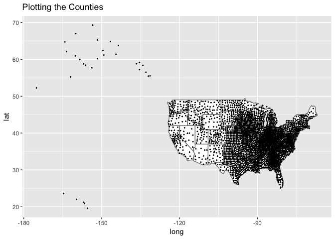

From the first map above, we see that Alaska and Hawaii are included in the map at far-away locations from the center of the map. However, since we are not including these two states in our study, we will drop them and replot the map below.

``` r
mapLoc = dataLoc[-c(68:92, 542:546),]
map = ggplot() + ggtitle("Plotting the Counties without Alaska & Hawaii")
map + geom_polygon(data = mapstate, aes(x=long, y=lat,group = group), colour="grey50", fill = "white") + geom_jitter(data = mapLoc, aes(x = longitude, y = latitude), size = 0.3)
```

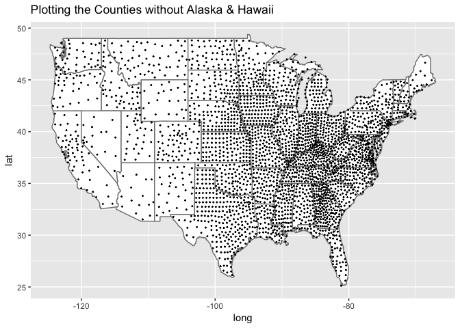

As we see that this second map excluding Alaska and Hawaii has all points are plotted within border of the US map, it is clear that the location coordinates are properly imported.

Data Merging Phase
------------------

In the data merging phase of the project, we then proceed to merge all the six individually obtained and cleaned dataframes into a single complete dataframe that contains the state, county, repVote and demVote for all four elections, longitude and latitude, and all 35 variables for each county obtained in the 2010 Census Data.

This merging process was done two dataframes at a time, merging on the commonly named "mergeID" column, and done with a union for all elections data sets, but with a outer join for location and census data. This was because only the location and census data was needed for the available counties. It would then be possible to check if the cleaning was sufficient by generally observing if the merged complete dataframe had the same number of rows as its constituent dataframes, as the desired merging process would not produce additional rows (presumably with NA values in certain columns).

### Merging All Dataframes

``` r
if (createAllSources) {
    # Merging each dataset together two at a time
    
    eDF = merge(eDF2016, eDF2012, by = "mergeID", all = TRUE)
    eDF = merge(eDF, eDF2008, by = "mergeID", all = TRUE)
    eDF = merge(eDF, eDF2004, by = "mergeID", all = TRUE)
    eDF = merge(eDF, dataLoc, by = "mergeID", all.x = TRUE)
    eDF = merge(eDF, CensusDF2010, by = "mergeID", all.x = TRUE)
    eDF = eDF[-c(3108:3109), -c(1,6,7,10,11,14,15,18,19,22,23)]
    
    #Supplement missing information from original sources
    #Location coordinates for Broomfield County in Colorado
    eDF$longitude[224] = -105.0867
    eDF$latitude[224] = 39.9205
    
    #Number of votes for District of Columnbia in 2008 Election
    eDF$repVote2008[292] = 17367
    eDF$demVote2008[292] = 254800
    
    save(eDF, file = "eDF.rda")
} else {
    load("eDF.rda")
}
```

EDA and Maps Making (by Jinjin Tang)
------------------------------------

``` r
require(maps)
require(ggplot2)
require(dplyr)
```

    ## Loading required package: dplyr

    ## 
    ## Attaching package: 'dplyr'

    ## The following objects are masked from 'package:stats':
    ## 
    ##     filter, lag

    ## The following objects are masked from 'package:base':
    ## 
    ##     intersect, setdiff, setequal, union

2016 Election Map

``` r
eDF1 <- data.frame(mergeID = paste(eDF$state2016, eDF$county2016, sep = ""), eDF)
eDFmap=eDF1[c(-519:-522),c("repVote2016", "demVote2016","TotalPop", "longitude", "latitude")]
eDFmap$propRep_2016=eDFmap$repVote2016/(eDFmap$repVote2016+eDFmap$demVote2016)
statemap = map_data("state")

blanktheme=theme(axis.line=element_blank(),
        axis.text.x=element_blank(),
          axis.text.y=element_blank(),
        axis.ticks=element_blank(),
          axis.title.x=element_blank(),
          axis.title.y=element_blank(),
        panel.grid.major=element_blank(),
        panel.grid.minor=element_blank())
        
ggplot()+
  geom_polygon(data=statemap,aes(x=long, y=lat, group=group), colour="grey50", fill="white") +
  geom_point(data=eDFmap,shape=21, aes(x=longitude, y=latitude, size=TotalPop/1000000, fill=propRep_2016), alpha=0.5, color="grey50", na.rm = TRUE)+ 
  scale_fill_gradientn("Proportion of Republican Voters",colours=c("blue", "white", "red"))+
  scale_size("Total Population in Millions",range=c(1,10))+
  blanktheme+
  ggtitle("2016 Election Results By County")+
  coord_fixed(1.3)
```

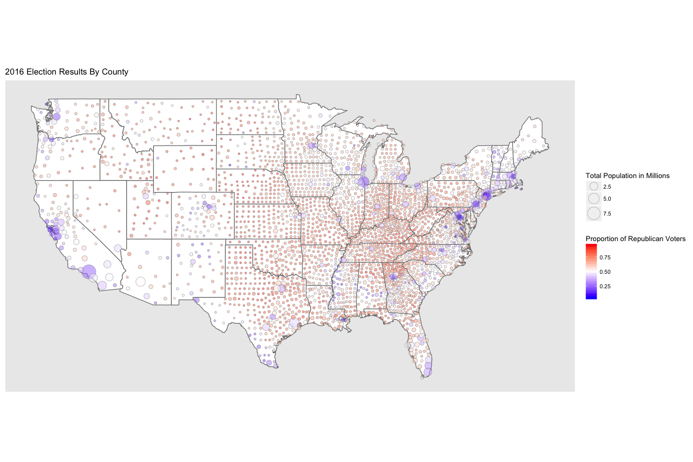

How has the number of votes changed in the past 4 elections?

``` r
totalVotes=data.frame(Year=rep(c(2004,2008,2012,2016),2) , 
                      Political_Party=rep(c("Republican", "Democrat"), each=4),
                      Votes = c(
                        sum(eDF1$repVote2004, na.rm = TRUE), 
                        sum(eDF1$repVote2008, na.rm = TRUE), 
                        sum(eDF1$repVote2012, na.rm = TRUE), 
                        sum(eDF1$repVote2016, na.rm = TRUE), 
                        sum(eDF1$demVote2004, na.rm = TRUE), 
                        sum(eDF1$demVote2008, na.rm = TRUE), 
                        sum(eDF1$demVote2012, na.rm = TRUE), 
                        sum(eDF1$demVote2016, na.rm = TRUE))) 

ggplot(data=totalVotes)+
  geom_line(aes(x=Year, y=Votes/1000000, color=Political_Party))+
  scale_y_continuous("Number of Votes in Millions")+
  geom_vline(xintercept=2004, linetype="longdash")+
  geom_text(aes(x=2003.5, label="Bush Victory", y=62), angle=90)+
  geom_vline(xintercept=2008, linetype="longdash")+
  geom_text(aes(x=2007.5, label="Obama Victory", y=62), angle=90)+
  geom_vline(xintercept=2012, linetype="longdash")+
  geom_text(aes(x=2011.5, label="Obama Victory", y=64), angle=90)+
  geom_vline(xintercept=2016, linetype="longdash")+
  geom_text(aes(x=2015.5, label="Trump Victory", y=63), angle=90)+
  scale_color_manual("Political Party", values=c("blue","red"))
```

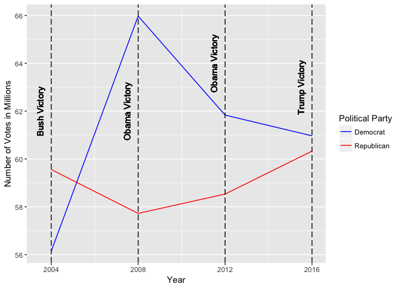

How have counties changed their voting patterns?

``` r
countiesmap=map_data("county")
countiesmap$region = gsub(" ", "", countiesmap$region)
countiesmap$mergeID=paste(countiesmap$region, countiesmap$subregion, sep='')
counties_base=ggplot(data=countiesmap,aes(x=long, y=lat, group=group))+geom_polygon(colour="black", fill=NA)
#counties_base

eDFvoting=eDF1[c(-519:-522),c("repVote2016", "demVote2016","repVote2012", "demVote2012", "repVote2008", "demVote2008", "repVote2004", "demVote2004", "longitude", "latitude", "mergeID")]

eDFvotingmerged=inner_join(countiesmap, eDFvoting, by="mergeID")
```

    ## Warning: Column `mergeID` joining character vector and factor, coercing
    ## into character vector

``` r
eDFvotingmerged$repWin2016=eDFvotingmerged$repVote2016>eDFvotingmerged$demVote2016
eDFvotingmerged$repWin2012=eDFvotingmerged$repVote2012>eDFvotingmerged$demVote2012
eDFvotingmerged$repWin2008=eDFvotingmerged$repVote2016>eDFvotingmerged$demVote2008
eDFvotingmerged$repWin2004=eDFvotingmerged$repVote2016>eDFvotingmerged$demVote2004
eDFvotingmerged$totalrepWin=rowSums(eDFvotingmerged[,18:21])

counties_base+
  geom_polygon(data = eDFvotingmerged, aes(x=long, y=lat, group=group, fill=totalrepWin), colour="grey50")+
  scale_fill_gradientn("Number of Republican Victories", colours=c("blue", "white", "red"))+
  ggtitle("Have Counties Changed Their Voting Patterns in the Past 4 Elections?")+
  blanktheme+
  coord_fixed(1.3)
```

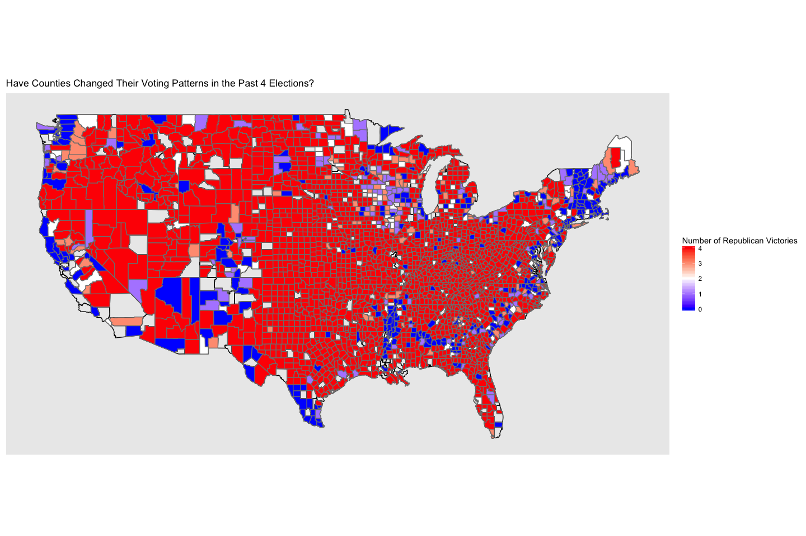

Does Education have an effect on how people vote?

``` r
eDFeducation=eDFmap
eDFeducation$college=eDF1[c(-519:-522), "PerBachelor"]
eDFeducation$mergeID=eDF1[c(-519:-522), "mergeID"]
eDFeducationmerged=inner_join(countiesmap, eDFeducation, by.="mergeID")
```

    ## Joining, by = "mergeID"

    ## Warning: Column `mergeID` joining character vector and factor, coercing
    ## into character vector

``` r
ggplot(data=eDFeducationmerged, aes(x=college, y=propRep_2016))+
  geom_point()+
  geom_hline(yintercept=0.5)+
  geom_smooth(method="lm")+
  scale_x_continuous("Percent of Population with Bachelor's Degree")+
  scale_y_continuous("Percent of Republican Voters in 2016")+
  ggtitle("Does Education Affect Political Affiliation?")
```

    ## Warning: Removed 67 rows containing non-finite values (stat_smooth).

    ## Warning: Removed 67 rows containing missing values (geom_point).

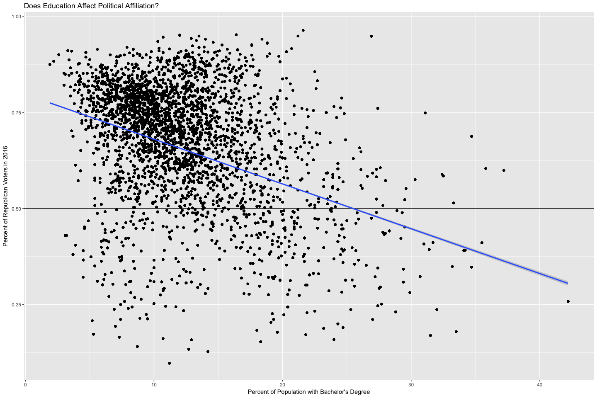

``` r
#this graph indicates that counties with a smaller percentage of population with Bachelor's degree will have more Republican voters

counties_base+
  geom_polygon(data = eDFeducationmerged, aes(x=long, y=lat, group=group, fill=college, colour=propRep_2016), size=0.75)+
scale_fill_gradient("Percent with Bachelor's Degree",low="grey", high="black")+
  scale_color_gradientn("Proportion of Republican Voters in 2016", colors=c("blue", "white", "red"))+
  ggtitle("Does Education Affect Political Affiliation?")+
  blanktheme+
  coord_fixed(1.3)
```

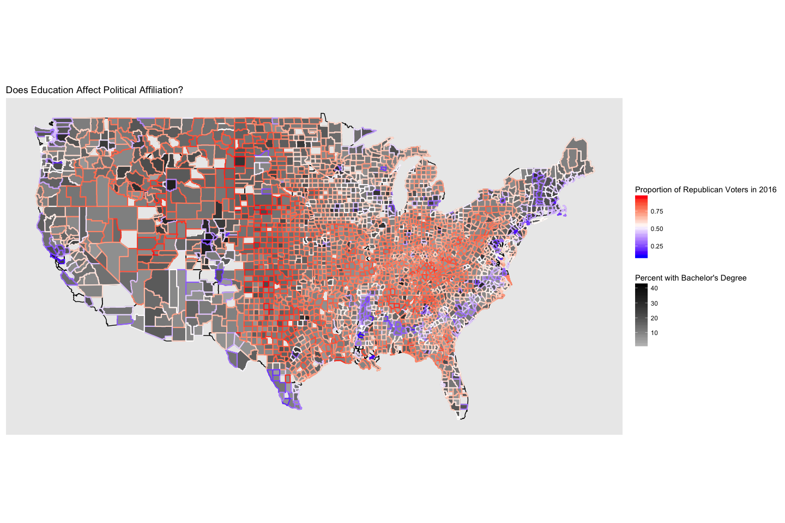

``` r
#it's hard to see much on a national level so let's focus on some specific states. I chose Michigan, Wisconsin, and Minnesota since they were extremely close states in this past election. The fact that these states have a mix of college towns and rural areas made them good candidates for this comparison as well.

subset=eDFeducationmerged[eDFeducationmerged$region %in% c("michigan", "wisconsin", "minnesota"),]
counties_base2=ggplot(data=subset,aes(x=long, y=lat, group=group))+geom_polygon(colour="black", fill=NA)

counties_base2+
geom_polygon(aes(fill=college), colour="white")+
geom_point(data=subset, (aes(x=longitude, y=latitude, group=NA, colour=propRep_2016)), size=5)+
scale_color_gradientn("Proportion of Republican Voters", colours=c("blue", "white", "red"))+
  scale_fill_gradient("Percent with Bachelor's Degree", low="grey", high="black")+
  ggtitle("Does Education Affect Political Affiliation?")+
  blanktheme+
  coord_fixed(1.3)
```

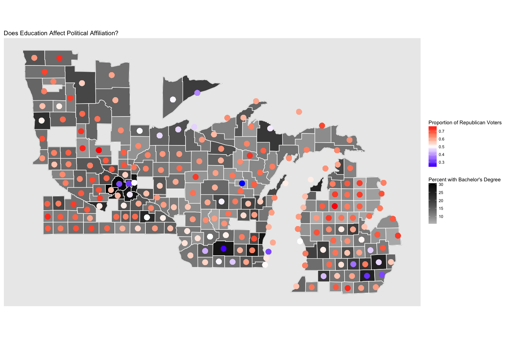

Predicting 2016 Election result using K-NN (by Wei-Hsin (Philip) Lin and Yang Yang)
-----------------------------------------------------------------------------------

This is prediction of 2016 Election result uses K-NN method.

To obtain the training and testing data sets, we use the following algorithm:

1.  For each county, we look at its voting records for Elections 2012, 2008, and 2004. If such county voted in favor of Republican at least twice out of the three elections, then we label it as Republican (rep), otherwise it is labeled as Democrat (dem). With such manner, we classify all counties as either "rep" or "dem". This is data set to be used.

2.  This data set is divided into training data and testing data by the following manner: For each state, 2/3 of its counties will be randomly assigned to training data, and the rest 1/3 go to testing data. Therefore, 2/3 of the whole data set will be assigned to training data, and 1/3 will be assigned to testing data. For the training data, we further divide it in to two halves: for each state, one half of its counties are randomly chosen to trainging set 1, and the rest of the counties in that state go to training set 2. At the end of such data partition, we will have training set 1, training set 2 and testing. Each of them will have approximately 1/3 of the original data.

3.  We use training set 1 and training set 2 as Two-fold Cross Validation to obtain a predictor with the best K value. Then the whole data set that generated at Step 1 is used as training data set, to predict Election 2016 at county level.

### Data Preparation

Firstly we make a subset of the final merged data frame "eDF" since not all the variables in the it will be used. Particularly, We are interested in logitude, latitude, all counties, states, number of votes for Republican and Democrat over the most recent your election. Also want to normalize the number of votes by converting it to rate of votes, so comparison is easier to make visually.

``` r
#Drop Hawaii, Alaska and census data. 
eDFNew = eDF[-c(68,519:522),1:12]

#Calculate rate of vote for Elections 2012, 2008 and 2004
eDFNew$repRate2012 = eDFNew$repVote2012 / (eDFNew$repVote2012 + eDFNew$demVote2012)
eDFNew$demRate2012 = 1 - eDFNew$repRate2012
eDFNew$repRate2008 = eDFNew$repVote2008 / (eDFNew$repVote2008 + eDFNew$demVote2008)
eDFNew$demRate2008 = 1 - eDFNew$repRate2008
eDFNew$repRate2004 = eDFNew$repVote2004 / (eDFNew$repVote2004 + eDFNew$demVote2004)
eDFNew$demRate2004 = 1 - eDFNew$repRate2004
```

### Determine Winner over Year 2004, 2008, and 2012

Then we figure out the winner and loser at county level by checking the voting records over Election 2012, 2008 and 2004. For each county, if it votes at least twice for Republican, then it is classied as "rep", otherwise, labeled as "dem". With such manner, we lable all counties as either "rep" or "dem".

``` r
#Determine winner at county level; 1 indicates rep wins, 0 indicates dem wins
result2016 = as.numeric(eDFNew$repVote2016 > eDFNew$demVote2016)
result2012 = as.numeric(eDFNew$repVote2012 > eDFNew$demVote2012)
result2008 = as.numeric(eDFNew$repVote2008 > eDFNew$demVote2008)
result2004 = as.numeric(eDFNew$repVote2004 > eDFNew$demVote2004)

#Change the dem's indicator from 0 to -1
result2016[result2012 == 0] = -1
result2012[result2012 == 0] = -1
result2008[result2008 == 0] = -1
result2004[result2004 == 0] = -1

#Combine three Election results into a data frame
result = data.frame(result2012, result2008, result2004)

#Label each county as either "rep" or "dem" based on their voting record over three Elections
sumresult = rowSums(result) 
eDFNew$winner = sapply(sumresult, function(x) ifelse(x > 0, "rep", "dem"))
```

### Preliminary Map

At this stage, we make a preliminary map to see if such rep/dem classification is reasonable.

``` r
#Make a preliminary map
library(ggplot2)

mapstate = map_data("state")

plot1 <- ggplot() + 
  geom_polygon(data = mapstate, aes(x = long, y = lat,group = group), 
               colour = "grey50", fill = "white") + 
  geom_point(data = eDFNew, aes(x = longitude, y = latitude, 
                                colour = factor(eDFNew$winner, 
                                                levels = c("rep", "dem"))), size = 0.3) + 
  labs(title = "Winner at county level", color = "Winner")

plot1
```

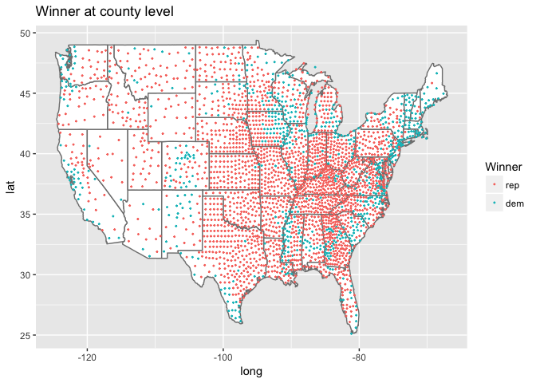

This map plots the winner at county level. The red points represents those counties that votes in favor of Republican, and the blue points represent Democrat's victories. Blue concentration occur alongside the East and West coast, and a vast majority of red points is observed in the middle of the US map. Since a traditional political map also has such victory distribution, such classification makes sense.

### Predictor Building Using K-NN Method

After the classification for each county, we divide these counties into three subsets: two training set call "training 1" and "training 2" repectively, and one testing set calles "testing". A county in a particular state has euqal probabilty to go to any one of these three subsets.

``` r
#Randomly generate 2 training sets and 1 testing set

#Obtain unique state names
state <- as.character(unique(eDFNew$state2016))

#Count the number of county in Alabama
index <- which(eDFNew$state2016 == state[1])

#Randomly assign all counties in Alabam to training1, training2 or testing
set.seed(1205)
sample <- sample(index, replace = FALSE, size = length(index))
training1 <- eDFNew[sample[1:floor(length(index)/3)], ]
training2 <- eDFNew[sample[(floor(length(index)/3) + 1):floor(2*length(index)/3)], ]
testing <- eDFNew[sample[(floor(2*length(index)/3) + 1):length(index)], ]

#For the rest of the state, Randomly assign their counties to training1, training2 or testing. 
for (i in 2:length(state)) {
  index <- which(eDFNew$state2016 == state[i])
  
  set.seed(1205)
  sample <- sample(index, replace = FALSE, size = length(index))
  training1_temp <- eDFNew[sample[1:floor(length(index)/3)], ]
  training2_temp <- eDFNew[sample[(floor(length(index)/3) + 1):floor(2*length(index)/3)], ]
  testing_temp <- eDFNew[sample[(floor(2*length(index)/3) + 1):length(index)], ]
  
  training1 <- rbind(training1, training1_temp)
  training2 <- rbind(training2, training2_temp)
  testing <- rbind(testing, testing_temp)
}
```

This procedure produces 3 subset of the original data: training1, training2 and testing.

With the training and testing data set ready, we can now use K-NN method to train the data and predict 2016 Election result. For each county, we look for its nearest k neighbor and determine the winner of the county by simple majority votes: if more than a half of the k neightbor counties vote for Republican, then the county's winner is also Republican, and vice versa. We also find the best k value by using two-fold Cross Validation on training1 and training2. To find the best k, we test 100 values ranging from 1 to 100.

``` r
#Use Cross Validation and K-NN to train data and find best k value.
library(class)

#Prepare the true value of training data set to be comapared against
training1Label = training1$winner
training2Label = training2$winner
trainingLabel = c(training1Label, training2Label)

#Test 100 k values ranging from 1 to 100
errorRate = vector(length = 100)
for (i in 1:100){
  pred1 = knn(train = training1[, c(11, 12)], test = training2[, c(11, 12)], 
              cl = training1Label, k=i)
  pred2 = knn(train = training2[, c(11, 12)], test = training1[, c(11, 12)], 
              cl = training2Label, k=i)
  pred = c(as.character(pred2), as.character(pred1))
  compare = pred == trainingLabel
  errorRate[i] = 1 - sum(compare) / length(compare)
}
```

We choose the best k by comparing error rates, which are associated with each of the k. Here we make a plot to see how the error rate behaves as k grows from 1 to 100.

``` r
library(ggplot2)

errorDF = data.frame(kvalue = c(1:100), errorRate)

plot2 <- ggplot() + 
  geom_line(data = errorDF, aes(x = kvalue, y = errorRate)) + 
  labs(title = "Error Rates for different k values")
plot2
```

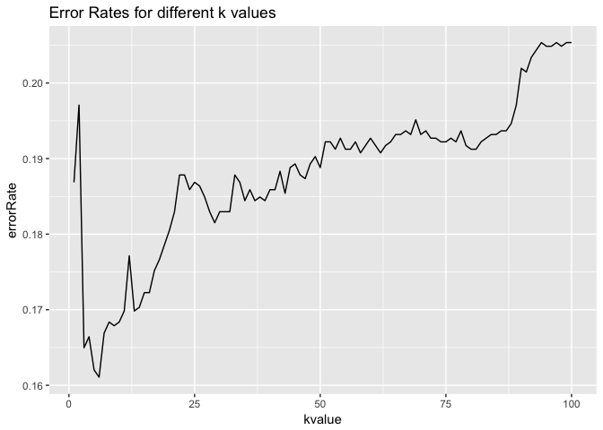

``` r
#Choose the best k value
bestk = errorDF$kvalue[which(errorDF$errorRate == min(errorDF$errorRate))] - 1
```

As it can be seen from the graph, the rate has a sharp and short increase at the beginning and the decreases to hit the lowest at around k = 5. After that it increases rapidly. Although the min function tells us the lowest rate occur at k = 5, we choose a nearby value (k = 4)to avoid bias.

How well does the best k work? To test it validity, we use training1 and training2 as a whole training set to predict the "testing" set, which we have set aside so far.

``` r
#Using the training data set 1 and training data set 2 as a whole to predict the testing data set
training = rbind(training1, training2)
testingLabel = testing$winner

predTest = knn(train = training[, c(11, 12)], test = testing[, c(11, 12)], cl = trainingLabel, k = bestk)
comapre = predTest == testingLabel
errorRate_testing = 1 - sum(compare) / length(compare)
#errorRate_testing = 0.2053528
```

The error rate is 0.2053528, which is acceptable given the size of training set and testing set.

### Prediction for 2016 Election

With the best k value at hand, it is now time to predict the 2016 Election result. The training set for such prediction is still the combination of training1 and traing2, but the testing set is all the counties in US mainland.

``` r
#Predict 2016 Election result

#This is the true election result
trueWinner2016 = sapply(result2016, function(x) ifelse(x > 0, "rep", "dem"))

#Make prediction for 2016election
predTest = knn(train = training[, c(11, 12)], test = eDFNew[, c(11,12)], cl = trainingLabel, k = bestk)

#Make comparison
compare = as.character(predTest) == trueWinner2016
errorRate2016 = 1 - sum(compare) / length(compare)#The error rate is about 0.1
#errorRate2016 = 0.1276596
```

The error rate for 2016 Election result prediction is about 0.1277, which is sustantially less the the error rate (about 0.2054) produced by predicting the testing data set. The reason behind such a drop in error rate is as follows: At the first prediction, the training set contains 2000 counties, and the testing set contains the rest 1000 counties. At the second prediction, the training set stays the same, but the training set expands to all 3000 counties, which means 2000 counties of the testing set are exactly the sames as the training set. Therefore the training data also predict itself, which increase the accuracy of prediction.

### 2016 Predicted Result v.s. 2016 Election Result

Finally we want to make two maps to make a visual comparison.

``` r
library(ggplot2)
#Create a data frame containing longitude, latitude, prediction and true result
dfResult2016 = data.frame(eDFNew$longitude, eDFNew$latitude, predTest, trueWinner2016)
names(dfResult2016)[c(1,2)] = c("longitude", "latitude")

#Map for predicted result
plot3 <- ggplot() + 
  geom_polygon(data = mapstate, 
               aes(x = long, y = lat, group = group), colour = "grey50", fill = "white") + 
  geom_point(data = dfResult2016, 
             aes(x = longitude, y = latitude, 
                 colour = factor(dfResult2016$predTest, 
                                 levels = c("rep", "dem"))), size = 0.3) + 
  labs(title = "Predicted Winner at county level", color = "Winner")
plot3
```

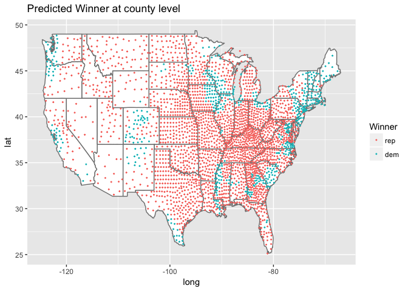

``` r
#Map for true result
plot4 <- ggplot() + 
  geom_polygon(data = mapstate, aes(x = long, y = lat, group = group), 
               colour = "grey50", fill = "white") + 
  geom_point(data = dfResult2016, aes(x = longitude, y = latitude, 
                                      colour = factor(dfResult2016$trueWinner2016, 
                                                      levels = c("rep", "dem"))), size = 0.3) + 
  labs(title = "True Winner at county level", color = "Winner") 
plot4
```

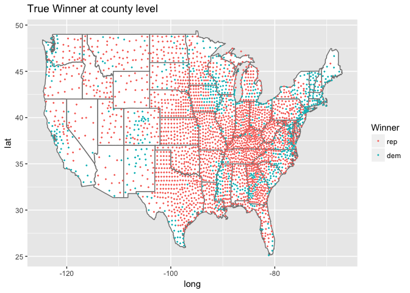

Both maps shows similar plotting pattern: red concentration in the middle occupies most of the US map with blue concentration occurs alongside East and West coasts, and the Great Lakes area. Note that it's hard to see which counties fail the prediction. Therefore, the map below shows the exact locations that the predtions failed.

``` r
library(ggplot2)
eDFpred <- data.frame(result = eDFNew$winner,predResult = predTest, error = compare, eDFNew[, 11:12])
plot5 <- ggplot(eDFpred[eDFpred$error == FALSE, ]) + 
  geom_polygon(data = mapstate, aes(x = long, y = lat, group = group), 
               colour = "grey50", fill = "white") + 
  geom_point(mapping = aes(x = longitude, y = latitude), size = 0.3, color = "forestgreen")
plot5
```

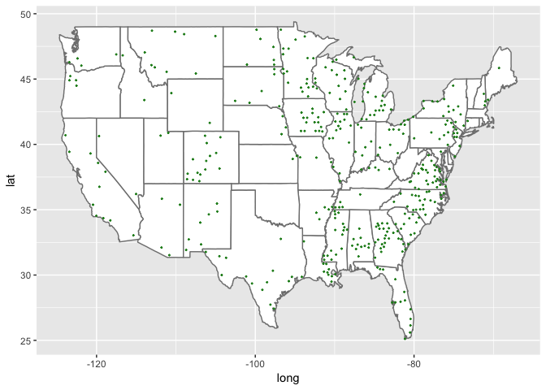

### Summary

K-NN is a simple but also accurate statistical method when it is used to predict the election result. By the mechanism of simple majority vote, K-NN predicts all the winner at county level with an error rate of 0.1277. Part of such low rate is made possible by the classification of all counties at the beginning of the prediction. Rather than using only a particular year's election result to train the data, we examine 3 election results and label each county as "rep" or "dem" accordingly. This makes our data set more reliable because the records of 3 consecutive years more or less reveal each county's preference. The drawback of this prediction is that the error rate is a little bit high when predicting the testing data set by two-fold Cross Validation. However, the error rate is expected to decrease if we increase the folds. In conclusion, the winner of Election 2016 is not a surprise at all, given that even such a simple project can predict the winner (at county level) with an error rate of 0.1277.

Predicting Change in Election Results (2012 - 2016) (by Tien & Zhi Chao)
------------------------------------------------------------------------

In this section, we build a prediction model for the change in election results from 2012 to 2016, and this is carried out in three parts - (i) Construction of a dataframe containing the predictor variables required for the analysis; (ii) Construction and validation of the prediction model; and (iii) analysis of the prediction results. The remaining of the section is structured as such: First a short description of each part will be provided, and comments in the subsequent code chunk will detail the exact steps carried out in the code.

### Part 1: Constructing the Dataframe

For the first part, we start by constructing a "changeID" columns denoting the actual change from 2012 to 2016, with the values of (1,2,3,4) representing counties that (stayedRep, stayedDem, wentRep, wentDem) respectively. Next, we use only county census data as our predictors, preparing the dataframe for subsequent prediction (eg dropping rows with NAs and converting columns into numeric classes)

``` r
library(rpart)
library(ggplot2)
library(dplyr)
library(rpart.plot)

## Defining a function to create changeID from the 2012 & 2016 voting results

createChangeID = function(voteResults) {
    
    repVote2016 = voteResults[[1]]
    demVote2016 = voteResults[[2]]
    repVote2012 = voteResults[[3]]
    demVote2012 = voteResults[[4]]
    
    changeID = repVote2016
    repWin2016 = (repVote2016 >= demVote2016)
    repWin2012 = (repVote2012 >= demVote2012)
    
    stayedRep = (repWin2016 & repWin2012)
    stayedDem = (!repWin2016 & !repWin2012)
    wentRep = (!repWin2012 & repWin2016)
    wentDem = (repWin2012 & !repWin2016)
    
    changeID[stayedRep] = 1
    changeID[stayedDem] = 2
    changeID[wentRep] = 3
    changeID[wentDem] = 4
    
    return (changeID)
}


## Preparing the DataFrame for Prediction

# Change "percentage unmarried women" from character to numeric
# Subset selected columns for census data
# Remove rows with NA values
# Create the changeID

eDF[,23]= as.numeric(eDF[,23])
```

    ## Warning: NAs introduced by coercion

``` r
changeDF = eDF[, c(1:6,11:45)]
changeDF = changeDF[apply(is.na(changeDF), 1, sum) == 0,]
changeDF["changeID"] = createChangeID(changeDF[,3:6])
changeDF = changeDF[,c(1:2,7:8,42, 9:41)]
```

### Part 2: Constructing the Model

For the second part, we construct a classification tree model with our prepared predictors and tune its complexity parameter with hold-out validation before testing the model on a final test set. To do so, we first partition out data randomly into a test set (20%), a validation set (20%), and a training set (60%). Next, we use the training set to train our model across various complexity parameters, graphically selecting the parameter value that performed the best on the validation set (in terms of prediction accuracy). Finally, we train the model with the selected complexity parameter on bothe the training and validation set, and evaluate its performance on the original test set to see its final effectiveness. Below, we find that the final performance of our model is 87 percent, which is rather satisfactory.

``` r
## Create the test, validation, and training set

# Test, validation, and training set have 20%, 20%, and 60% of the data each
# Seed is set to ensure reproducibility of data

set.seed(123456789)
nRowsTotal = nrow(changeDF)
chooseTandV = sample(nRowsTotal, size = nRowsTotal*0.4, replace = FALSE)
changeTandV = changeDF[-chooseTandV,]
nRowsTandV = nrow(changeTandV)
chooseTest = sample(nRowsTandV, size = nRowsTandV*0.5, replace = FALSE)

changeTest = changeTandV[chooseTest,]
changeVal = changeTandV[-chooseTest,]
changeTrain = changeDF[-chooseTandV,]

nRowsTest = nrow(changeTest)
nRowsVal = nrow(changeVal)
nRowsTrain = nrow(changeTrain)


## Building the Classification Tree Model

# Create a list of potential complexity parameters
# Training a model for each complexity value

cmplxParamList = c(seq(0.0001, 0.001, by = 0.0002), 
                    seq(0.001, 0.01, by = 0.002),
                    seq(0.01, 0.1, by = 0.02))

modelPred = matrix(nrow = nRowsVal, ncol = length(cmplxParamList))

for (i in 1:length(cmplxParamList)) {
    modelTree = rpart(changeID ~ ., data = changeTrain[,5:38], method = "class", 
                      control = rpart.control(cp = cmplxParamList[i]))
    modelPred[, i] = predict(modelTree, newdata = changeVal[,5:38], type = "class")
}

# Choose the model with the highest prediction accuracy ()

modelPredAcc = apply(modelPred == changeVal$changeID, 2, sum)
modelPredAcc = modelPredAcc/nRowsVal
modelPredAccDF = data.frame(complexity = cmplxParamList, accuracy = modelPredAcc)
modelPredAccPlot = ggplot(data = modelPredAccDF, aes(x = complexity, y = accuracy)) +
                      geom_line() + labs(x = "Complexity", y = "Accuracy")
modelPredAccPlot
```


``` r
# Testing the model on the test set
# By visual inspection we choose complexity parameter 0.001 with 0.8946 accuracy
# Final prediction accuracy is shown at around 87 percent

changeTrainAll = rbind(changeTrain, changeVal)
nRowsTrainAll = nrow(changeTrainAll)
modelTreeF = rpart(changeID ~ ., data = changeTrainAll[,5:38], method = "class", 
                      control = rpart.control(cp = cmplxParamList[6]))
modelPredF = predict(modelTreeF, newdata = changeTest[,5:38], type = "class")
modelPredAccF = sum(modelPredF == changeTest$changeID)/nRowsTest
modelPredAccF
```

    ## [1] 0.8658009

### Part 3: Analysing the Results

In the third part, we analyse the results of our prediction model over and beyond just its final prediction accuracy. First, the classification tree is plotted to give a rough idea of the branches in the decision process.

``` r
## Plotting the classification tree 

# The original tree has been trimmed as it is too complicated
# Complexity parameter has been set at 0.008

modelTreeFPlot = prune(modelTreeF, cp=0.008)
prp(modelTreeFPlot, extra =2)
```


Next, the accuracies for each state are tallied and shown. It should be noted that most of the states are predicted accurately 75 percent and above. Additionally, some states such as Vermont and Maine have around 50 percent accurate because they have less number of counties, which affects the ratio for the value of percentage.

``` r
## Prediction accuracy is analyzed for each state individually

# The model is now trained on all of the data
# It is used to predict results from every state
# The percentage of correctly predicted counties in each state is computed
# States with the highest prediction inaccuracy are shown below

modelPredFAll = predict(modelTreeF, newdata = changeDF[,5:38], type = "class")

changeDFPred = data.frame(state = changeDF$state2016, county = changeDF$county2016,
                          changeID = changeDF$changeID, changeIDPred =modelPredFAll,
                          predCorrect = (changeDF$changeID == modelPredFAll), 
                          longitude =  changeDF$longitude, latitude = changeDF$latitude)

statesCNo = aggregate(changeDFPred$predCorrect, list(state = changeDFPred$state), sum)
statesTNo = aggregate(changeDFPred$predCorrect, list(state = changeDFPred$state), length)
statesCNo$x = statesCNo$x*100
statesCPer = data.frame(state = statesCNo$state, percentage = statesCNo$x/statesTNo$x, noCounties = statesTNo$x)
statesCPer = arrange(statesCPer, percentage, noCounties)
head(statesCPer,15)
```

    ##            state percentage noCounties
    ## 1        vermont   50.00000         14
    ## 2          maine   50.00000         16
    ## 3    rhodeisland   60.00000          5
    ## 4   newhampshire   60.00000         10
    ## 5      newmexico   61.29032         31
    ## 6     washington   61.53846         39
    ## 7        newyork   66.12903         62
    ## 8       delaware   66.66667          3
    ## 9    southdakota   71.87500         64
    ## 10          iowa   72.72727         99
    ## 11       arizona   73.33333         15
    ## 12        hawaii   75.00000          4
    ## 13     wisconsin   75.00000         72
    ## 14 southcarolina   76.08696         46
    ## 15      colorado   77.41935         62

Fnally, we plot on the map counties which had the wrong predictions to visualize spatially where the predictions were wrong for. This map is shown below.

``` r
## Make a plot of the counties with the wrong predictions

# Drop hawaii to facilitate map plotting

changeDFPred = changeDFPred[changeDFPred$state != "hawaii", ]

accPlot = ggplot(changeDFPred[changeDFPred$predCorrect == FALSE,]) + 
               geom_polygon(data = mapstate, aes(x = long, y = lat, group = group), 
               colour = "grey50", fill = "white") + 
               geom_point(mapping = aes(x = longitude, y = latitude), size = 1, color = "red") +                ggtitle("Wrong Prediction Locations")
accPlot
```


Comparison of Two Predictors
----------------------------

We investigate the errors further by checking where they occur. Firstly we plot all the counties that fail in the two prediction model. As it can be seen from the map, blue points represent the errors that produced only by the regression tree model, green points represent the errors that produced only by the K-NN model, and red points are the common errors that arise from both models. While red errors are significantly less than the blue and green ones, all three kind of errors appear mostly along the Great Lake area and the East coast, which means these areas are not easy to predict by regression tree and K-NN. This is so because most of these failed counties are in the swing states. For example, we can see large concentrations of in Wisconsin, Michigan, North Caroline and Florida, all of which are considered battlegrounds for Republicans and Democrats. Counties in swing states are more difficult to predict than those in solid red or solid blue state, because different political ideologies advocated by Republicans and Democrats have similarly amount of supporters. Therefore, it is no surprising that prediction models are more likely to fail in those swing counties.

``` r
dfMap = merge(eDFpred, changeDFPred, by = "longitude")
dfMap = dfMap[,c(6,7,4,10,1,5)]
dfMap$acc = NA
dfMap$acc[dfMap$error == FALSE & dfMap$predCorrect == FALSE] = 1
dfMap$acc[dfMap$error == FALSE & dfMap$predCorrect == TRUE] = 2
dfMap$acc[dfMap$error == TRUE & dfMap$predCorrect == FALSE] = 3
dfMap = dfMap[!is.na(dfMap$acc), ]
dfMap$acc = factor(dfMap$acc, levels = c(1,2,3), labels = c("Both Models Wrong", "2016 Wrong", "Change 12-16 Wrong"))

ggplot() + 
  geom_polygon(data = mapstate, aes(x = long, y = lat, group = group), 
               colour = "grey50", fill = "white") + 
  geom_point(data = dfMap, 
             mapping = aes(x = longitude, y = latitude.x, color = acc), size = 1) + 
                labs(title = "Comparision of Failed Prediction Locations", 
                    color = "Error")
```


References:
-----------

### Language Uses:

R

### Packages Use:

readr, XML, readxl, RCurl, dplyr, ggplot2, class, rpart

### Data Sources:

2016 Presidential Election results reported at the county level. These are available at <http://www.stat.berkeley.edu/users/nolan/data/voteProject/2016_US_County_Level_Presidential_Results.csv> The original data are from github account at <https://github.com/tonmcg/County_Level_Election_Results_12-16/blob/master/2016_US_County_Level_Presidential_Results.csv>

2012 Presidential Election results reported at the county level. The original data are available from <http://www.politico.com/2012-election/map/#/President/2012/> These data are available at <http://www.stat.berkeley.edu/users/nolan/data/voteProject/countyVotes2012/xxx>. xml Where xxx stands for state names. e.g. <http://www.stat.berkeley.edu/users/nolan/data/voteProject/countyVotes2012/alabama.xml>

2008 Presidential Election results (county level) are available from The Guardian in a Google Sheet at <https://www.theguardian.com/news/datablog/2009/mar/02/us-elections-2008> This sheet has been uploaded as an xlsx spreadsheet at <http://www.stat.berkeley.edu/users/nolan/data/voteProject/countyVotes2008.xlsx>

2004 Presidential Election results (county level) without Virginia are available at <http://www.stat.berkeley.edu/users/nolan/data/voteProject/countyVotes2004.txt> 2004 Election Data for Virginia is available at <https://en.wikipedia.org/wiki/United_States_presidential_election_in_Virginia,_2004>

Census data from the 2010 census available at <http://factfinder2.census.gov/faces/nav/jsf/pages/searchresults.xhtml?refresh=t> Data available at <http://www.stat.berkeley.edu/users/nolan/data/voteProject/census2010/B01003.csv> <http://www.stat.berkeley.edu/users/nolan/data/voteProject/census2010/DP02.csv> <http://www.stat.berkeley.edu/users/nolan/data/voteProject/census2010/DP03.csv> <http://www.stat.berkeley.edu/users/nolan/data/voteProject/census2010/B01_metadata.txt> <http://www.stat.berkeley.edu/users/nolan/data/voteProject/census2010/DP02_metadata.txt> <http://www.stat.berkeley.edu/users/nolan/data/voteProject/census2010/DP03_metadata.txt>

GML (Geographic Markup Language) data that contains the latitude and longitude for each county. These are available at <http://www.stat.berkeley.edu/users/nolan/data/voteProject/counties.gml>

### Sources used to clean data:

In 2016 data, state names were given in abbreviations. The comparison table is available at
<http://www.fonz.net/blog/wp-content/uploads/2008/04/states.csv>

Figure out Dade County in Florida is also known as Miami-Dade County <http://miamidade.gov/>

Oglala Lakota County, known as Shannon County until May 2015, is a county located in the U.S. state of South Dakota. <https://en.wikipedia.org/wiki/Oglala_Lakota_County,_South_Dakota>

Figure out counties names may be called as different names in New York Five boroughs of New York City. Five of New York's counties are each coextensive with New York City's five boroughs and do not have county governments. They are: New York County (Manhattan), Kings County (Brooklyn), Bronx County (The Bronx), Richmond County (Staten Island), and Queens County (Queens). <https://en.wikipedia.org/wiki/List_of_counties_in_New_York>

The location coordinates of Broomfield County in Colorado is found at <http://www.latlong.net/place/broomfield-co-usa-3794.html>

The 2008 Election result for District of Columnbia is found at <https://en.wikipedia.org/wiki/United_States_presidential_election_in_the_District_of_Columbia,_2008>

Contribution:
-------------

Wei-Hsin (Philip) Lin: 2008, Predicting 2016 Election result using K-NN

Yang Yang: 2012, Predicting 2016 Election result using K-NN

Zhi Chao Poh: 2004, Predicting Change in Election Results (2012 - 2016)

Tien Nguyen: 2010 (Census Data), Predicting Change in Election Results (2012 - 2016)

Jinjin Tang: 2016, EDA and Maps Making

Altogether: the rest
