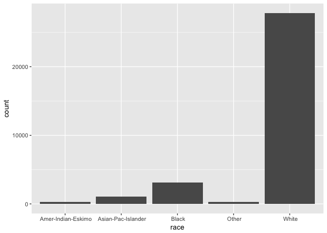
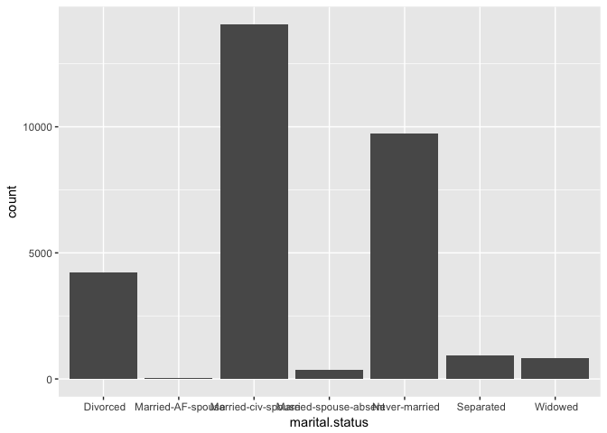
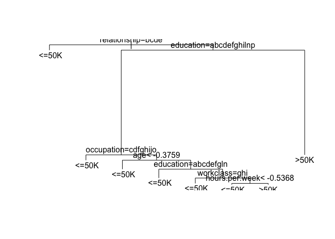
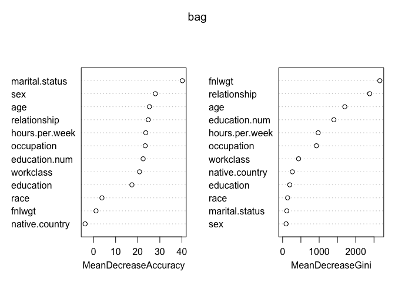

Stat 154 - Fall 2017, Final Project
================
Due date: December 10, 2017

Data
----

The data set for this project is the [Census Income Data Set](https://archive.ics.uci.edu/ml/datasets/Census+Income) donated by Ronny Kohavi and Barry Becker to the UCI Machine Learning Repository.

The data set describes 15 variables on a sample of individuals from the US Census database. The prediction task is to determine whether a person makes over 50K a year.

``` r
# Read in training set
train = read.csv("../data/adult.data", header = FALSE)
names(train) = c('age', 'workclass', 'fnlwgt', 'education', 'education.num', 'marital.status', 'occupation', 'relationship', 'race', 'sex', 'capital.gain', 'capital.loss', 'hours.per.week', 'native.country', 'income')

# Read in test set
test = read.csv("../data/adult.test", header = FALSE)
names(test) = c('age', 'workclass', 'fnlwgt', 'education', 'education.num', 'marital.status', 'occupation', 'relationship', 'race', 'sex', 'capital.gain', 'capital.loss', 'hours.per.week', 'native.country', 'income')
```

#### Match up The Response Variable

``` r
dat = train

dat_test = test
levels(dat_test$income) = levels(dat$income)
```

Preprocessing and Exploratory Data Analysis
-------------------------------------------

Start your analysis cycle with an exploratory phase so you get to know and understand the data set. Below is a (non-comprehensive) list of (optional) considerations to keep in mind:

-   Handling missing values
-   Handling outliers
-   Changing scales
-   Binning (i.e. discretizing)
-   Converting to (dummy) indicators
-   Summary statistics
-   Visualizing distributions
-   Association between each predictor and the response

``` r
summary(dat)
```

    ##       age                    workclass         fnlwgt       
    ##  Min.   :17.00    Private         :22696   Min.   :  12285  
    ##  1st Qu.:28.00    Self-emp-not-inc: 2541   1st Qu.: 117827  
    ##  Median :37.00    Local-gov       : 2093   Median : 178356  
    ##  Mean   :38.58    ?               : 1836   Mean   : 189778  
    ##  3rd Qu.:48.00    State-gov       : 1298   3rd Qu.: 237051  
    ##  Max.   :90.00    Self-emp-inc    : 1116   Max.   :1484705  
    ##                  (Other)          :  981                    
    ##          education     education.num                  marital.status 
    ##   HS-grad     :10501   Min.   : 1.00    Divorced             : 4443  
    ##   Some-college: 7291   1st Qu.: 9.00    Married-AF-spouse    :   23  
    ##   Bachelors   : 5355   Median :10.00    Married-civ-spouse   :14976  
    ##   Masters     : 1723   Mean   :10.08    Married-spouse-absent:  418  
    ##   Assoc-voc   : 1382   3rd Qu.:12.00    Never-married        :10683  
    ##   11th        : 1175   Max.   :16.00    Separated            : 1025  
    ##  (Other)      : 5134                    Widowed              :  993  
    ##             occupation            relationship  
    ##   Prof-specialty :4140    Husband       :13193  
    ##   Craft-repair   :4099    Not-in-family : 8305  
    ##   Exec-managerial:4066    Other-relative:  981  
    ##   Adm-clerical   :3770    Own-child     : 5068  
    ##   Sales          :3650    Unmarried     : 3446  
    ##   Other-service  :3295    Wife          : 1568  
    ##  (Other)         :9541                          
    ##                   race            sex         capital.gain  
    ##   Amer-Indian-Eskimo:  311    Female:10771   Min.   :    0  
    ##   Asian-Pac-Islander: 1039    Male  :21790   1st Qu.:    0  
    ##   Black             : 3124                   Median :    0  
    ##   Other             :  271                   Mean   : 1078  
    ##   White             :27816                   3rd Qu.:    0  
    ##                                              Max.   :99999  
    ##                                                             
    ##   capital.loss    hours.per.week         native.country     income     
    ##  Min.   :   0.0   Min.   : 1.00    United-States:29170    <=50K:24720  
    ##  1st Qu.:   0.0   1st Qu.:40.00    Mexico       :  643    >50K : 7841  
    ##  Median :   0.0   Median :40.00    ?            :  583                 
    ##  Mean   :  87.3   Mean   :40.44    Philippines  :  198                 
    ##  3rd Qu.:   0.0   3rd Qu.:45.00    Germany      :  137                 
    ##  Max.   :4356.0   Max.   :99.00    Canada       :  121                 
    ##                                   (Other)       : 1709

``` r
summary(dat_test)
```

    ##       age                    workclass         fnlwgt       
    ##  Min.   :17.00    Private         :11210   Min.   :  13492  
    ##  1st Qu.:28.00    Self-emp-not-inc: 1321   1st Qu.: 116736  
    ##  Median :37.00    Local-gov       : 1043   Median : 177831  
    ##  Mean   :38.77    ?               :  963   Mean   : 189436  
    ##  3rd Qu.:48.00    State-gov       :  683   3rd Qu.: 238384  
    ##  Max.   :90.00    Self-emp-inc    :  579   Max.   :1490400  
    ##                  (Other)          :  482                    
    ##          education    education.num                  marital.status
    ##   HS-grad     :5283   Min.   : 1.00    Divorced             :2190  
    ##   Some-college:3587   1st Qu.: 9.00    Married-AF-spouse    :  14  
    ##   Bachelors   :2670   Median :10.00    Married-civ-spouse   :7403  
    ##   Masters     : 934   Mean   :10.07    Married-spouse-absent: 210  
    ##   Assoc-voc   : 679   3rd Qu.:12.00    Never-married        :5434  
    ##   11th        : 637   Max.   :16.00    Separated            : 505  
    ##  (Other)      :2491                    Widowed              : 525  
    ##             occupation            relationship 
    ##   Prof-specialty :2032    Husband       :6523  
    ##   Exec-managerial:2020    Not-in-family :4278  
    ##   Craft-repair   :2013    Other-relative: 525  
    ##   Sales          :1854    Own-child     :2513  
    ##   Adm-clerical   :1841    Unmarried     :1679  
    ##   Other-service  :1628    Wife          : 763  
    ##  (Other)         :4893                         
    ##                   race            sex         capital.gain  
    ##   Amer-Indian-Eskimo:  159    Female: 5421   Min.   :    0  
    ##   Asian-Pac-Islander:  480    Male  :10860   1st Qu.:    0  
    ##   Black             : 1561                   Median :    0  
    ##   Other             :  135                   Mean   : 1082  
    ##   White             :13946                   3rd Qu.:    0  
    ##                                              Max.   :99999  
    ##                                                             
    ##   capital.loss    hours.per.week         native.country     income     
    ##  Min.   :   0.0   Min.   : 1.00    United-States:14662    <=50K:12435  
    ##  1st Qu.:   0.0   1st Qu.:40.00    Mexico       :  308    >50K : 3846  
    ##  Median :   0.0   Median :40.00    ?            :  274                 
    ##  Mean   :  87.9   Mean   :40.39    Philippines  :   97                 
    ##  3rd Qu.:   0.0   3rd Qu.:45.00    Puerto-Rico  :   70                 
    ##  Max.   :3770.0   Max.   :99.00    Germany      :   69                 
    ##                                   (Other)       :  801

#### Visualizing Distributions of Raw Data

``` r
library(ggplot2)
num_var = which(sapply(dat, class) != "factor")
cat_var = which(sapply(dat, class) == "factor")
g = ggplot(dat)
for(i in num_var) {
  # gi = g + geom_point(aes(x = 1:nrow(dat), y = dat[, i])) + labs(x = "index", y = names(dat)[1])
  # print(gi)
  print(g + geom_density(aes(x = dat[, i])) + xlab(names(dat)[i]))
}
```


``` r
for(i in cat_var) {
  gi = g + geom_bar(aes(x = dat[, i])) + xlab(names(dat)[i])
  print(gi)
}
```



#### Handling Missing Values

``` r
# By looking at the summary statistic and the outputs below, there seems to be no missing values in variables age, fnlwgt, education, education-num, marital-status, relationship, race, sex, hours-per-week, and income. 
# Therefore, for these variables, we do not need to handle the missing values. 
unique(dat$education)
```

    ##  [1]  Bachelors     HS-grad       11th          Masters       9th         
    ##  [6]  Some-college  Assoc-acdm    Assoc-voc     7th-8th       Doctorate   
    ## [11]  Prof-school   5th-6th       10th          1st-4th       Preschool   
    ## [16]  12th        
    ## 16 Levels:  10th  11th  12th  1st-4th  5th-6th  7th-8th ...  Some-college

``` r
unique(dat$occupation)
```

    ##  [1]  Adm-clerical       Exec-managerial    Handlers-cleaners
    ##  [4]  Prof-specialty     Other-service      Sales            
    ##  [7]  Craft-repair       Transport-moving   Farming-fishing  
    ## [10]  Machine-op-inspct  Tech-support       ?                
    ## [13]  Protective-serv    Armed-Forces       Priv-house-serv  
    ## 15 Levels:  ?  Adm-clerical  Armed-Forces ...  Transport-moving

``` r
unique(dat$native.country)
```

    ##  [1]  United-States               Cuba                      
    ##  [3]  Jamaica                     India                     
    ##  [5]  ?                           Mexico                    
    ##  [7]  South                       Puerto-Rico               
    ##  [9]  Honduras                    England                   
    ## [11]  Canada                      Germany                   
    ## [13]  Iran                        Philippines               
    ## [15]  Italy                       Poland                    
    ## [17]  Columbia                    Cambodia                  
    ## [19]  Thailand                    Ecuador                   
    ## [21]  Laos                        Taiwan                    
    ## [23]  Haiti                       Portugal                  
    ## [25]  Dominican-Republic          El-Salvador               
    ## [27]  France                      Guatemala                 
    ## [29]  China                       Japan                     
    ## [31]  Yugoslavia                  Peru                      
    ## [33]  Outlying-US(Guam-USVI-etc)  Scotland                  
    ## [35]  Trinadad&Tobago             Greece                    
    ## [37]  Nicaragua                   Vietnam                   
    ## [39]  Hong                        Ireland                   
    ## [41]  Hungary                     Holand-Netherlands        
    ## 42 Levels:  ?  Cambodia  Canada  China  Columbia ...  Yugoslavia

``` r
# workclass
# Seems like there are only small number (1836 comparing to 32561) of workclass is missing, so I choose to omit the observations. 
rmIndexWC = which(dat$workclass == " ?")
length(rmIndexWC)
```

    ## [1] 1836

``` r
# occupation
# Seems like there are only small number (1843 comparing to 32561) of occupation is missing, so I choose to omit the observations. 
rmIndexOC = which(dat$occupation == " ?")
length(rmIndexOC)
```

    ## [1] 1843

``` r
# native-country
# Seems like there are only small number (583 comparing to 32561) of native-country is missing, so I choose to omit the observations. 
rmIndexNC = which(dat$native.country == " ?")
length(rmIndexNC)
```

    ## [1] 583

``` r
# Also noticed that there are some data have more than one missing values across workclass, occupation, and native-country, which means that we don't really have to delete that many observations from our training data. 
sum(rmIndexOC == rmIndexWC)
```

    ## Warning in rmIndexOC == rmIndexWC: longer object length is not a multiple
    ## of shorter object length

    ## [1] 352

``` r
# capital-gain
# capital-loss
# Since there are too many missing values in 'capital-gain' and 'capital-loss', I choose to omit these two variables 
n = nrow(dat)
n
```

    ## [1] 32561

``` r
sum(dat$capital.gain == 0)
```

    ## [1] 29849

``` r
sum(dat$capital.loss == 0)
```

    ## [1] 31042

``` r
rmIndex = unique(c(rmIndexNC, rmIndexOC, rmIndexWC))
dat = dat[-rmIndex, -c(11, 12)]
dat_test = dat_test[, -c(11, 12)]
dim(dat)
```

    ## [1] 30162    13

``` r
# After removing missing values, we still have 30162 observations, which is still large, so we are good to go. 
```

``` r
n = nrow(dat)
full = rbind(dat, dat_test)
dat = full[1:n, ]
dat_test = full[(n+1):nrow(full), ]
```

#### Changing Scale

``` r
num_var = which(sapply(dat, class) != "factor")
cat_var = which(sapply(dat, class) == "factor")

# Only change the scales of numerical variables
# It doesn't really make sense to transform the categorical variables
for(i in num_var) {
  dat[, i] = as.numeric(scale(dat[, i]))
  m = mean(dat[, i])
  s = sd(dat[, i])
  dat_test[, i] = as.numeric(scale(dat_test[, i], center = m, scale = s))
}
```

#### Visualizing Distributions after Cleaning

``` r
library(ggplot2)
g = ggplot(dat)
for(i in num_var) {
  # gi = g + geom_point(aes(x = 1:nrow(dat), y = dat[, i])) + labs(x = "index", y = names(dat)[1])
  # print(gi)
  print(g + geom_density(aes(x = dat[, i])) + xlab(names(dat)[i]))
}
```


``` r
for(i in cat_var) {
  gi = g + geom_bar(aes(x = dat[, i])) + xlab(names(dat)[i])
  print(gi)
}
```



#### Association between each predictor and the response

``` r
for(i in 1:(ncol(dat)-1)) {
  r = cor(as.numeric(dat[, i]), as.numeric(dat$income))
  print(paste("The correlation between", names(dat)[i], "and income is", round(r, 4)))
}
```

    ## [1] "The correlation between age and income is 0.242"
    ## [1] "The correlation between workclass and income is 0"
    ## [1] "The correlation between fnlwgt and income is -0.009"
    ## [1] "The correlation between education and income is 0.079"
    ## [1] "The correlation between education.num and income is 0.3353"
    ## [1] "The correlation between marital.status and income is -0.1935"
    ## [1] "The correlation between occupation and income is 0.0516"
    ## [1] "The correlation between relationship and income is -0.251"
    ## [1] "The correlation between race and income is 0.0717"
    ## [1] "The correlation between sex and income is 0.2167"
    ## [1] "The correlation between hours.per.week and income is 0.2295"
    ## [1] "The correlation between native.country and income is 0.0233"

### Build a Classification Tree

-   Fit a classification tree (see examples in ISL chapter 8, and APM chapter 14).
-   Make plots and describe the steps you took to justify choosing optimal tuning parameters.
-   Report your 5 (or 6 or 7) important features (could be either just 5, or 6 or 7), with their variable importance statistics.
-   Report the training accuracy rate.
-   Plot the ROC curve, and report its area under the curve (AUC) statistic.

#### Model

``` r
library(rpart)

# Naively use rpart default
set.seed(303)
rp = rpart(income ~., data = dat)
plot(rp)
text(rp)
```


``` r
printcp(rp)
```

    ## 
    ## Classification tree:
    ## rpart(formula = income ~ ., data = dat)
    ## 
    ## Variables actually used in tree construction:
    ## [1] age          education    occupation   relationship
    ## 
    ## Root node error: 7508/30162 = 0.24892
    ## 
    ## n= 30162 
    ## 
    ##         CP nsplit rel error  xerror      xstd
    ## 1 0.129995      0   1.00000 1.00000 0.0100018
    ## 2 0.011121      2   0.74001 0.74001 0.0089670
    ## 3 0.010000      5   0.69579 0.70844 0.0088158

#### Parameter Tuning

``` r
set.seed(226)
tun_rp = rpart(income ~., data = dat, cp = .001)
printcp(tun_rp)
```

    ## 
    ## Classification tree:
    ## rpart(formula = income ~ ., data = dat, cp = 0.001)
    ## 
    ## Variables actually used in tree construction:
    ## [1] age            education      hours.per.week native.country
    ## [5] occupation     relationship   sex            workclass     
    ## 
    ## Root node error: 7508/30162 = 0.24892
    ## 
    ## n= 30162 
    ## 
    ##           CP nsplit rel error  xerror      xstd
    ## 1  0.1299947      0   1.00000 1.00000 0.0100018
    ## 2  0.0111215      2   0.74001 0.74001 0.0089670
    ## 3  0.0043953      5   0.69579 0.69872 0.0087680
    ## 4  0.0030634      6   0.69140 0.69712 0.0087600
    ## 5  0.0021977      7   0.68833 0.69286 0.0087388
    ## 6  0.0021311     11   0.67954 0.68913 0.0087202
    ## 7  0.0019535     15   0.67035 0.68767 0.0087128
    ## 8  0.0016427     18   0.66449 0.68567 0.0087028
    ## 9  0.0014651     23   0.65357 0.67794 0.0086636
    ## 10 0.0013985     24   0.65210 0.67555 0.0086514
    ## 11 0.0010655     26   0.64931 0.66969 0.0086213
    ## 12 0.0010211     28   0.64718 0.66929 0.0086193
    ## 13 0.0010000     31   0.64411 0.66835 0.0086145

``` r
plot(tun_rp$cptable[-1, 1], tun_rp$cptable[-1, 4], xlab = "Complexity Parameter", ylab = "Cross-Validation Error")
lines(tun_rp$cptable[-1, 1], tun_rp$cptable[-1, 4])
```


Noticed that all the complexity parameters below 0.002 have about the same crossvalidation error. To avoid overfit the data, choose cp = 0.002 for less number of splits.

#### Model Selected and Training Accuracy

``` r
# Choose 0.002 as my new cp
rp1 = rpart(income ~., data = dat, cp = .0022)
plot(rp1)
text(rp1)
```



``` r
accuracy = mean((predict(rp1)[, 2] > 0.5) == (dat$income == levels(dat$income)[2]))
accuracy
```

    ## [1] 0.8286586

#### ROC Curve and AUC

``` r
library(ROCR)
```

    ## Loading required package: gplots

    ## 
    ## Attaching package: 'gplots'

    ## The following object is masked from 'package:stats':
    ## 
    ##     lowess

``` r
y = as.numeric(dat$income == levels(dat$income)[2])
classified = as.numeric(predict(rp1)[, 2] > 0.5)
pred_roc = prediction(classified, y)
roc = performance(pred_roc, measure = "tpr", x.measure = "fpr") 
plot(roc)
abline(0, 1, lty = 2)
```


``` r
roc_per = performance(pred_roc, measure="auc") 
auc = slot(roc_per, 'y.values')[[1]]
paste("The AUC statistic of the selected model is", round(auc, 4))
```

    ## [1] "The AUC statistic of the selected model is 0.7258"

### Build a Bagged Tree

-   Train a Random Forest classifier (see examples in ISL chapter 8, and APM chapter 14)
-   Make plots and describe the steps you took to justify choosing optimal tuning parameters.
-   Report your 5 (or 6 or 7) important features (could be either just 5, or 6 or 7), with their variable importance statistics.
-   Report the training accuracy rate.
-   Plot the ROC curve, and report its area under the curve (AUC) statistic.

#### Model

``` r
library(randomForest)
```

    ## randomForest 4.6-12

    ## Type rfNews() to see new features/changes/bug fixes.

    ## 
    ## Attaching package: 'randomForest'

    ## The following object is masked from 'package:ggplot2':
    ## 
    ##     margin

``` r
bag = randomForest(income ~., data = dat, mtry = ncol(dat)-1, ntree = 1, importance = TRUE)
bag
```

    ## 
    ## Call:
    ##  randomForest(formula = income ~ ., data = dat, mtry = ncol(dat) -      1, ntree = 1, importance = TRUE) 
    ##                Type of random forest: classification
    ##                      Number of trees: 1
    ## No. of variables tried at each split: 12
    ## 
    ##         OOB estimate of  error rate: 23.9%
    ## Confusion matrix:
    ##         <=50K  >50K class.error
    ##  <=50K   7485   806  0.09721385
    ##  >50K    1827   901  0.66972141

#### Parameter Tuning

``` r
library(caret)
```

    ## Loading required package: lattice

``` r
n = nrow(dat)
B = seq(200, 350, 15)

# B = seq(100, 200, 10)
# B = seq(50, 120, 10)
# B = seq(10, 60, 10)

set.seed(0336)
folds = createFolds(1:n)

acc_mat = matrix(0, length(B), 10)
j = 1
for(fold in folds) {
  cv_train = dat[-fold, ]
  cv_test = dat[fold, ]
  acc = c()
  for(i in 1:length(B)) {
    bag = randomForest(income ~., mtry = ncol(dat)-1, data = dat, ntree = B[i])
    pred = predict(bag, cv_test)
    acc[i] = mean(pred == cv_test$income)
  }
  acc_mat[, j] = acc
  j = j + 1
}
acc_mat
```

    ##            [,1]      [,2]      [,3]      [,4]      [,5]      [,6]
    ##  [1,] 0.8183626 0.8209549 0.8041100 0.8129973 0.7960875 0.8116711
    ##  [2,] 0.8147166 0.8222812 0.8001326 0.8129973 0.7940981 0.8116711
    ##  [3,] 0.8190255 0.8199602 0.8094133 0.8073607 0.7954244 0.8110080
    ##  [4,] 0.8196884 0.8176393 0.8027842 0.8093501 0.7917772 0.8153183
    ##  [5,] 0.8196884 0.8166446 0.8047730 0.8053714 0.7901194 0.8163130
    ##  [6,] 0.8200199 0.8202918 0.8034471 0.8106764 0.7950928 0.8113395
    ##  [7,] 0.8163739 0.8216180 0.8034471 0.8090186 0.7954244 0.8146552
    ##  [8,] 0.8193570 0.8179708 0.8027842 0.8100133 0.7944297 0.8153183
    ##  [9,] 0.8180312 0.8186340 0.8031157 0.8100133 0.7927719 0.8126658
    ## [10,] 0.8180312 0.8179708 0.8041100 0.8129973 0.7960875 0.8106764
    ## [11,] 0.8173682 0.8179708 0.8067617 0.8090186 0.7967507 0.8136605
    ##            [,7]      [,8]      [,9]     [,10]
    ##  [1,] 0.8192971 0.8129973 0.8255968 0.8143236
    ##  [2,] 0.8163130 0.8126658 0.8192971 0.8136605
    ##  [3,] 0.8163130 0.8100133 0.8206233 0.8159814
    ##  [4,] 0.8196286 0.8126658 0.8199602 0.8136605
    ##  [5,] 0.8212865 0.8143236 0.8196286 0.8106764
    ##  [6,] 0.8186340 0.8146552 0.8212865 0.8139920
    ##  [7,] 0.8176393 0.8126658 0.8199602 0.8133289
    ##  [8,] 0.8179708 0.8090186 0.8196286 0.8133289
    ##  [9,] 0.8156499 0.8143236 0.8179708 0.8149867
    ## [10,] 0.8149867 0.8129973 0.8173077 0.8126658
    ## [11,] 0.8183024 0.8129973 0.8216180 0.8139920

``` r
xacc = rowMeans(acc_mat)
xacc
```

    ##  [1] 0.8136398 0.8117833 0.8125123 0.8122473 0.8118825 0.8129435 0.8124131
    ##  [8] 0.8119820 0.8118163 0.8117831 0.8128440

``` r
plot(B, xacc, xlab = "Number of Trees", ylab = "Accuracy")
lines(B, xacc)
```


``` r
best_B = B[which.max(xacc)]
best_B
```

    ## [1] 200

``` r
# 200
```

#### Model Selected, Training Accuracy, and Importance

``` r
bag = randomForest(income ~., data = dat, mtry = ncol(dat)-1, ntree = best_B, importance = TRUE)
impor = importance(bag)
MDA = sort(impor[, 3], decreasing = TRUE)
gini = sort(impor[, 4], decreasing = TRUE)
varImpPlot(bag)
```



``` r
paste("By looking at Mean Decrease Accuracy, the 5 most important features and its variable importance statistics are")
```

    ## [1] "By looking at Mean Decrease Accuracy, the 5 most important features and its variable importance statistics are"

``` r
MDA[1:5]
```

    ## marital.status            sex            age   relationship hours.per.week 
    ##       40.18132       27.97400       25.31649       24.76938       23.63853

``` r
paste("By looking at Mean Decrease Gini, the 5 most important features and its variable importance statistics are")
```

    ## [1] "By looking at Mean Decrease Gini, the 5 most important features and its variable importance statistics are"

``` r
gini[1:5]
```

    ##         fnlwgt   relationship            age  education.num hours.per.week 
    ##      2659.1086      2380.3314      1701.1472      1402.1597       972.6501

``` r
accuracy_bag = (bag$confusion[1, 1] + bag$confusion[2, 2]) / n
accuracy_bag
```

    ## [1] 0.7614548

#### ROC Curve and AUC

``` r
y = as.numeric(dat$income == levels(dat$income)[2])
classified = as.numeric(predict(bag) == levels(dat$income)[2])
pred_roc = prediction(classified, y)
roc = performance(pred_roc, measure = "tpr", x.measure = "fpr") 
plot(roc)
abline(0, 1, lty = 2)
```


``` r
roc_per = performance(pred_roc, measure="auc") 
auc = slot(roc_per, 'y.values')[[1]]
paste("The AUC statistic of the selected model is", round(auc, 4))
```

    ## [1] "The AUC statistic of the selected model is 0.5325"

### Build a Random Forest

-   Train a Random Forest classifier (see examples in ISL chapter 8, and APM chapter 14)
-   Make plots and describe the steps you took to justify choosing optimal tuning parameters.
-   Report your 5 (or 6 or 7) important features (could be either just 5, or 6 or 7), with their variable importance statistics.
-   Report the training accuracy rate.
-   Plot the ROC curve, and report its area under the curve (AUC) statistic.

#### Model

``` r
rf = randomForest(income ~., data = dat, mtry = ncol(dat)-1, ntree = best_B, importance = TRUE)
rf
```

    ## 
    ## Call:
    ##  randomForest(formula = income ~ ., data = dat, mtry = ncol(dat) -      1, ntree = best_B, importance = TRUE) 
    ##                Type of random forest: classification
    ##                      Number of trees: 200
    ## No. of variables tried at each split: 12
    ## 
    ##         OOB estimate of  error rate: 23.84%
    ## Confusion matrix:
    ##         <=50K  >50K class.error
    ##  <=50K  22421   233  0.01028516
    ##  >50K    6958   550  0.92674481

#### Parameter Tuning

``` r
n = nrow(dat)
V = 1:(ncol(dat)-1)

acc_mat = matrix(0, length(V), 10)
j = 1
acc = c()
for(fold in folds) {
  cv_train = dat[-fold, ]
  cv_test = dat[fold, ]
  for(i in V) {
    rf = randomForest(income ~., data = dat, mtry = i, ntree = best_B)
    pred = predict(rf, cv_test)
    acc[i] = mean(pred == cv_test$income)
  }
  acc_mat[, j] = acc
  j = j + 1
}
acc_mat
```

    ##            [,1]      [,2]      [,3]      [,4]      [,5]      [,6]
    ##  [1,] 0.8064302 0.7977454 0.7838913 0.7927719 0.7861406 0.7987401
    ##  [2,] 0.7752735 0.7881300 0.7759364 0.7854775 0.7831565 0.7977454
    ##  [3,] 0.7898575 0.7891247 0.7769307 0.7891247 0.7755305 0.7821618
    ##  [4,] 0.7964866 0.7964191 0.7815711 0.7861406 0.7738727 0.7884615
    ##  [5,] 0.8024528 0.7997347 0.7832284 0.7881300 0.7791777 0.7944297
    ##  [6,] 0.8031157 0.8093501 0.7868744 0.7934350 0.7775199 0.8003979
    ##  [7,] 0.8077560 0.8093501 0.7915147 0.7980769 0.7861406 0.8027188
    ##  [8,] 0.8110706 0.8110080 0.7954922 0.7997347 0.7858090 0.8030504
    ##  [9,] 0.8107391 0.8143236 0.7968180 0.8027188 0.7914456 0.8110080
    ## [10,] 0.8127279 0.8123342 0.7991382 0.8040451 0.7954244 0.8083554
    ## [11,] 0.8163739 0.8169761 0.7988068 0.8113395 0.7934350 0.8149867
    ## [12,] 0.8167053 0.8192971 0.8024528 0.8076923 0.7944297 0.8110080
    ##            [,7]      [,8]      [,9]     [,10]
    ##  [1,] 0.7984085 0.8010610 0.8110080 0.8120027
    ##  [2,] 0.7874668 0.7914456 0.7940981 0.7877984
    ##  [3,] 0.7881300 0.7851459 0.7947613 0.7877984
    ##  [4,] 0.8020557 0.7897878 0.7967507 0.7974138
    ##  [5,] 0.7947613 0.7950928 0.7997347 0.7974138
    ##  [6,] 0.8047082 0.7980769 0.8060345 0.8007294
    ##  [7,] 0.8057029 0.8017241 0.8113395 0.8066976
    ##  [8,] 0.8113395 0.7974138 0.8106764 0.8043767
    ##  [9,] 0.8073607 0.8040451 0.8139920 0.8070292
    ## [10,] 0.8106764 0.8096817 0.8153183 0.8100133
    ## [11,] 0.8176393 0.8116711 0.8179708 0.8139920
    ## [12,] 0.8179708 0.8129973 0.8176393 0.8116711

``` r
xacc = rowMeans(acc_mat)
xacc
```

    ##  [1] 0.7988199 0.7866528 0.7858565 0.7908960 0.7934156 0.7980242 0.8021021
    ##  [8] 0.8029971 0.8059480 0.8077715 0.8113191 0.8111864

``` r
plot(V, xacc, xlab = "Number of Predictors Considered", ylab = "Accuracy")
lines(V, xacc)
```


``` r
best_V = which.max(xacc)
best_V
```

    ## [1] 11

``` r
# 11
```

#### Model Selected, Training Accuracy, and Importance

``` r
rf = randomForest(income ~., data = dat, mtry = best_V, ntree = best_B, importance = TRUE)
impor = importance(rf)
MDA = sort(impor[, 3], decreasing = TRUE)
gini = sort(impor[, 4], decreasing = TRUE)
varImpPlot(rf)
```


``` r
paste("By looking at Mean Decrease Accuracy, the 5 most important features and its variable importance statistics are")
```

    ## [1] "By looking at Mean Decrease Accuracy, the 5 most important features and its variable importance statistics are"

``` r
MDA[1:5]
```

    ## marital.status            sex     occupation  education.num hours.per.week 
    ##       39.81212       27.56972       21.91579       21.70893       21.32754

``` r
paste("By looking at Mean Decrease Gini, the 5 most important features and its variable importance statistics are")
```

    ## [1] "By looking at Mean Decrease Gini, the 5 most important features and its variable importance statistics are"

``` r
gini[1:5]
```

    ##         fnlwgt   relationship            age  education.num hours.per.week 
    ##      2630.8688      2255.5416      1703.5707      1297.2661       971.2474

``` r
accuracy_rf = (rf$confusion[1, 1] + rf$confusion[2, 2]) / n
accuracy_rf
```

    ## [1] 0.7587693

#### ROC Curve and AUC

``` r
y = as.numeric(dat$income == levels(dat$income)[2])
classified = as.numeric(predict(rf) == levels(dat$income)[2])
pred_roc = prediction(classified, y)
roc = performance(pred_roc, measure = "tpr", x.measure = "fpr") 
plot(roc)
abline(0, 1, lty = 2)
```


``` r
roc_per = performance(pred_roc, measure="auc") 
auc = slot(roc_per, 'y.values')[[1]]
paste("The AUC statistic of the selected model is", round(auc, 4))
```

    ## [1] "The AUC statistic of the selected model is 0.5252"

### Model Selection

-   Validate your best supervised classifier on the test set.
-   Compute the confusion matrix.
-   Using the class "over 50K a year" as the positive event, calculate the *Sensitivity* or *True Positive Rate* (TPR), and the *Specificity* or *True Negative Rate* (TNR).
-   Plot the ROC curves of all the classifiers.

#### Predicted Values

``` r
# There is no reason to lower type 1 or type 2 error, so I choose 0.5 as my threshold
y_test = dat_test$income
pred_rp = predict(rp1, dat_test)[, 2] >= 0.5
pred_rp = as.numeric(pred_rp)

pred_bag = predict(bag, dat_test, type = "response") 
pred_rf = predict(rf, dat_test, type = "response")
```

#### Confusion Matrices

``` r
n_test = nrow(dat_test)
# Classification Tree
# Income <50 is encoded as 0, and >=50 is encoded as 1
y_t = as.numeric(dat_test$income == levels(dat_test$income)[2])
conf_mat_rp = confusionMatrix(pred_rp, y_t, positive = "1")
conf_mat_rp$table
```

    ##           Reference
    ## Prediction     0     1
    ##          0 11349  1760
    ##          1  1086  2086

``` r
conf_mat_rp$byClass[1:2]
```

    ## Sensitivity Specificity 
    ##   0.5423817   0.9126659

``` r
accuracy_rp = sum(diag(conf_mat_rp$table)) / n_test
accuracy_rp
```

    ## [1] 0.825195

``` r
# Bagged Tree
conf_mat_bag = confusionMatrix(pred_bag, y_test, positive = levels(dat_test$income)[2])
conf_mat_bag$table
```

    ##           Reference
    ## Prediction  <=50K  >50K
    ##      <=50K  11154  3230
    ##      >50K    1281   616

``` r
conf_mat_bag$byClass[1:2]
```

    ## Sensitivity Specificity 
    ##   0.1601664   0.8969843

``` r
accuracy_bag = sum(diag(conf_mat_bag$table)) / n_test
accuracy_bag
```

    ## [1] 0.7229286

``` r
# Random Forest
conf_mat_rf = confusionMatrix(pred_rf, y_test, positive = levels(dat_test$income)[2])
conf_mat_rf$table
```

    ##           Reference
    ## Prediction  <=50K  >50K
    ##      <=50K  11989  3526
    ##      >50K     446   320

``` r
conf_mat_rf$byClass[1:2]
```

    ## Sensitivity Specificity 
    ##  0.08320333  0.96413349

``` r
accuracy_rf = sum(diag(conf_mat_rf$table)) / n_test
accuracy_rf
```

    ## [1] 0.7560346

``` r
# Classification Tree
y = y_t
classified = pred_rp
pred_roc = prediction(classified, y)
roc = performance(pred_roc, measure = "tpr", x.measure = "fpr") 
plot(roc)
abline(0, 1, lty = 2)
```


``` r
roc_per = performance(pred_roc, measure="auc") 
auc = slot(roc_per, 'y.values')[[1]]
paste("The AUC statistic of classification tree model is", round(auc, 4))
```

    ## [1] "The AUC statistic of classification tree model is 0.7275"

``` r
# Bagged Tree
classified = as.numeric(pred_bag) - 1
pred_roc = prediction(classified, y)
roc = performance(pred_roc, measure = "tpr", x.measure = "fpr") 
plot(roc)
abline(0, 1, lty = 2)
```


``` r
roc_per = performance(pred_roc, measure="auc") 
auc = slot(roc_per, 'y.values')[[1]]
paste("The AUC statistic of bagged tree model is", round(auc, 4))
```

    ## [1] "The AUC statistic of bagged tree model is 0.5286"

``` r
# Random Forest
classified = as.numeric(pred_rf) - 1
pred_roc = prediction(classified, y)
roc = performance(pred_roc, measure = "tpr", x.measure = "fpr") 
plot(roc)
abline(0, 1, lty = 2)
```


``` r
roc_per = performance(pred_roc, measure="auc") 
auc = slot(roc_per, 'y.values')[[1]]
paste("The AUC statistic of random forest model is", round(auc, 4))
```

    ## [1] "The AUC statistic of random forest model is 0.5237"
