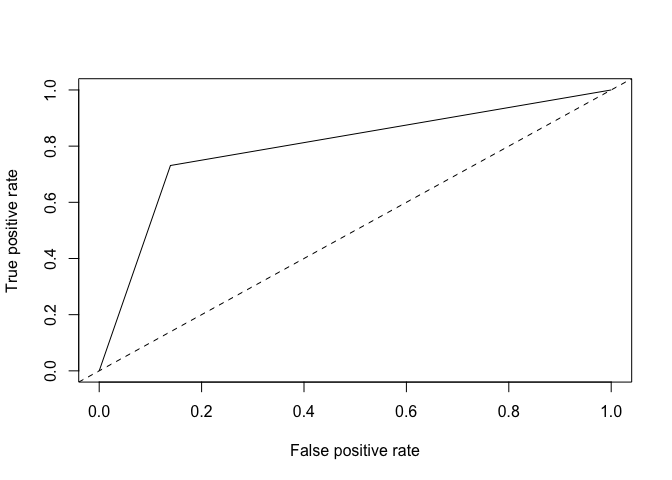

Titanic Survivor Analysis
================
Philip Lin
11/21/2017

Data
----

From <https://www.kaggle.com/c/titanic/data>

``` r
training = read.csv("train.csv")
training = na.omit(training)

all(!duplicated(training[, 1]))
```

    ## [1] TRUE

``` r
all(!duplicated(training[, 4]))
```

    ## [1] TRUE

``` r
# Drop PassengerId and Name since they are all distinct 
# Drop Ticket since it cause logistic regression diverges
dat = training[, -c(1, 4, 9, 11)]
```

### Naive Logistic Regression

``` r
fit = glm(Survived ~., data = dat, family = binomial)
err_rate = mean(as.numeric(fit$fitted.values > 0.5) != training$Survived)
err_rate
```

    ## [1] 0.1988796

### Variable Selection

#### Forward and Backward Selection Using OLS

``` r
library(SignifReg)
forward = SignifReg(Survived ~., data = dat, direction = "forward")
backward = SignifReg(Survived ~., data = dat, direction = "backward")

for_mod = forward$model
back_mod = backward$model

all(sort(names(for_mod)) == sort(names(back_mod)))
```

    ## [1] TRUE

``` r
# Since forward and backward selection provide the same model, only one need to be tested 
fit_for_back = glm(Survived ~., data = for_mod, family = binomial)
err_rate_for_back = mean(as.numeric(fit_for_back$fitted.values > 0.5) != training$Survived)
err_rate_for_back
```

    ## [1] 0.1918768

#### Backward Selection

``` r
back_dat = dat
fit_back = glm(Survived ~., data = back_dat, family = binomial)
err_rate_back = mean(as.numeric(fit_back$fitted.values > 0.5) != training$Survived)

while(TRUE) {
  errors = c()
  for(i in 2:ncol(back_dat)) {
    fit_back = glm(Survived ~., data = back_dat[, -i], family = binomial)
    errors[i] = mean(as.numeric(fit_back$fitted.values > 0.5) != training$Survived)
  }
  min_error = min(errors, na.rm = TRUE)
  min_index = which.min(errors)
  if(min_error < err_rate_back) {
    err_rate_back = min_error
    back_dat = back_dat[, -min_index]
  } else if(min_error == err_rate_back) {
    break
  }
}
fit_back = glm(Survived ~., data = back_dat, family = binomial)
err_rate_back = mean(as.numeric(fit_back$fitted.values > 0.5) != training$Survived)
err_rate_back
```

    ## [1] 0.1918768

#### Forward Selection

``` r
for_dat = data.frame(Survived = dat[, 1])
fit_for = glm(Survived ~., data = for_dat, family = binomial)
err_rate_for = mean(as.numeric(fit_for$fitted.values > 0.5) != training$Survived)
vars = names(dat[, -1])
for_names = c()
while(TRUE) {
  errors = c()
  for(i in 1:length(vars)) {
    fit_for = glm(Survived ~., data = cbind(for_dat, dat[, vars[i]]), family = binomial)
    errors[i] = mean(as.numeric(fit_for$fitted.values > 0.5) != training$Survived)
  }
  names(errors) = vars
  min_error = min(errors, na.rm = TRUE)
  min_index = which.min(errors)
  vars = vars[-min_index]
  
  if(min_error < err_rate_for) {
    err_rate_for = min_error
    for_dat = cbind(for_dat, dat[, names(min_index)])
    for_names = c(for_names, names(min_index))
    names(for_dat) = c("Survived", for_names)
  } else if(min_error == err_rate_for) {
    break
  }
  if(length(vars) == 0) break
}

fit_for = glm(Survived ~., data = for_dat, family = binomial)
err_rate_for = mean(as.numeric(fit_for$fitted.values > 0.5) != training$Survived)
err_rate_for
```

    ## [1] 0.219888

#### Confusion Matrix

After performing variable selections, the best result I got was from the backward selection.

``` r
classified = as.numeric(fit_back$fitted.values > 0.5)
observed = dat$Survived
conf_mat = table(observed, classified)
conf_mat
```

    ##         classified
    ## observed   0   1
    ##        0 365  59
    ##        1  78 212

#### ROC Curve

``` r
library(ROCR)
```

    ## Loading required package: gplots

    ## 
    ## Attaching package: 'gplots'

    ## The following object is masked from 'package:stats':
    ## 
    ##     lowess

``` r
pred_roc = prediction(classified, observed)

roc = performance(pred_roc, measure = "tpr", x.measure = "fpr")
plot(roc)
abline(0, 1, lty = 2)
```



``` r
roc_per = performance(pred_roc, measure="auc")
slot(roc_per, 'y.values')[[1]]
```

    ## [1] 0.7959418

#### Conclusion

``` r
library(caret)
```

    ## Loading required package: lattice

    ## Loading required package: ggplot2

``` r
fit = fit_back
dat = back_dat
names(dat)
```

    ## [1] "Survived" "Pclass"   "Sex"      "Age"      "SibSp"    "Parch"

``` r
insample_error = err_rate_back
insample_error
```

    ## [1] 0.1918768

``` r
set.seed(0336)
folds = createFolds(1:nrow(back_dat))
errors = c()
j = 1
for(fold in folds) {
  cv_train = dat[-fold, ]
  cv_test = dat[fold, ]
  cv_fit = glm(Survived ~., data = cv_train, family = binomial)
  pred = as.numeric(predict(cv_fit, cv_test) > 0.5)
  errors[j] = mean(pred != cv_test$Survived)
  j = j + 1
}
mean(errors)
```

    ## [1] 0.1971753

After performing variable selections, the best model I obtained was the one contains Pclass, Sex, Age, and SibSp as explanatory variables.

Using the model to perform logistic regression, we have overall in-sample error rate of 0.1919, cross-validation error of 0.1972, and we have the AUC(area under curve) of ROC Curve of 0.8523, which indicate the model is somehow not too bad.
